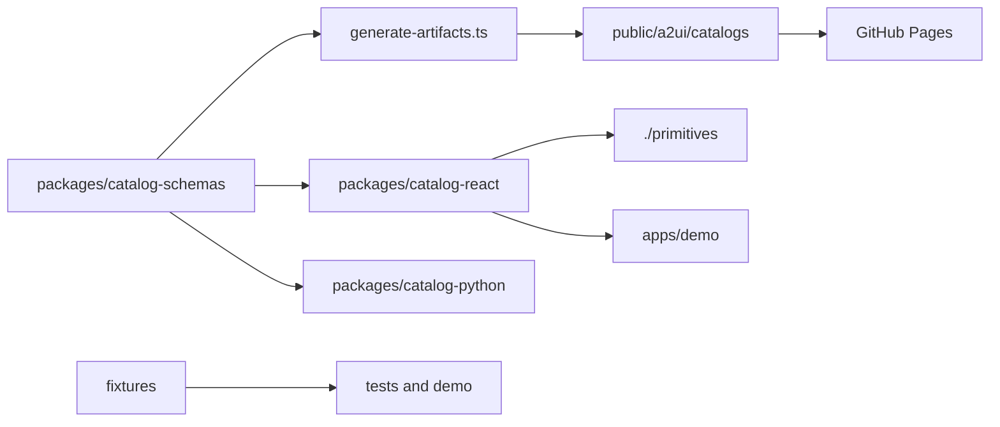

# AI37 A2UI Catalog

<!-- ai37:card:start (managed by doc-bot — do not edit inside) -->
# ai37-a2ui-catalog

## Описание

Монорепозиторий каталога A2UI для экосистемы AI-37: канонические Zod-схемы компонентов, React-рендереры, Pydantic-модели валидации, общие фикстуры и тесты. Артефакты каталога публикуются на GitHub Pages и используются для отрисовки и валидации A2UI-сообщений. В составе — доменные карточки результатов расчётов (`ThermalReport` — теплотехнический расчёт по СП 50.13330, `LiftReport` — расчёт лифтов по ГОСТ Р 52941-2008 / ГОСТ 34758-2021, `KeoReport`, `InsolationReport`), редакторы исходных данных (`ConstructionsEditor`/`ConstructionsEditorNext`, `LiftEditor`/`LiftEditorNext`, `KeoEditor`/`KeoEditorNext`, `InsolationEditor`) и набор переиспользуемых UI-примитивов (`@ai37/a2ui-catalog-react/primitives`).

## Стек

TypeScript, React 19, Zod (zod-to-json-schema), @a2ui/react / @a2ui/web_core (overrides: 0.10.1), @base-ui/react ^1.7.0 (поведение UI), katex, Vite, Vitest, tsup, tsx, Python 3.13+ + Pydantic, Poetry 2.3.2, Twine, pnpm (>=10, packageManager pnpm@10.29.3), Node >=22. Версия пакетов workspace — 0.34.4. Публикация пакетов — в приватные реестры AI-37 (npm.app.sp-ai.ru и pypi.app.sp-ai.ru). Константы дебаунса автодрафта условий: `CONDITIONS_DRAFT_DEBOUNCE_MS = 500` мс (@ai37/a2ui-catalog-react), `LIFT_DRAFT_DEBOUNCE_MS = 500` мс.

## Схема работы

Workspace состоит из пакетов:
- packages/catalog-schemas — канонические Zod-схемы, метаданные каталога, генерация JSON Schema и артефактов каталога;
- packages/catalog-react — React-рендереры и регистрация компонентов в каталоге; подпуть экспорта `./primitives` — набор примитивов каталога: токены слоями (`--a2ui-text-*`, `--a2ui-btn-*`, `--a2ui-card-*`), `Button`, `Card`, `Chip` (в т.ч. `tone="warning"`), три ступени текста, `Form`/`Field`/`Input`/`Static`, обёртки над Base UI (`Lookup` на `Autocomplete`, `Select`, `NumberField`, `Menu` с `trigger="link"`), `SectionItem`, `SummaryCollapsible`, `Combo`, `SourceNote`, `KitStyles`, а также примитивы отчётов: `ReportRow`, `DataChip`, `StatusPill`, `ReportHeadline` (ступень `display` с осью `--a2ui-font-serif`), `ReportTable`, `ReportNote`, `ReportProtocolCard`, ось `Menu side="top"`; корень набора — класс `a2ui-kit`, пороги колонок `FORM_TWO_COLUMNS_AT = 500`, `FORM_THREE_COLUMNS_AT = 620`;
- packages/catalog-python — Pydantic-модели и валидация на стороне Python;
- apps/demo — Vite-приложение для ручной проверки A2UI-сообщений; витрина примитивов — `/proba/system`;
- fixtures — общие валидные, невалидные и сквозные фикстуры сообщений.

Поток данных: схемы → generate-artifacts.ts → catalog.json и component schemas → public/a2ui/catalogs → GitHub Pages. React-рендереры и Pydantic-модели подключаются к тем же компонентам; тесты и демо используют фикстуры.

Доменные компоненты (catalog v2, набор расширяется аддитивно):
- отчёты: `ThermalReport`, `LiftReport`, `KeoReport`, `InsolationReport` — вердикт, рекомендации/проверки, исходные данные по источникам, протокол; для `ThermalReport` и `LiftReport` рядом зарегистрированы `ThermalReportNext`/`LiftReportNext` на наборе примитивов — те же схемы props (`thermalReportPropsSchema`, `liftReportPropsSchema`) и тот же контракт действий (`{event: {name, context: payload ?? {}}}`), своих листов стилей у них нет;
- редакторы: `ConstructionsEditor` (+ рядом `ConstructionsEditorNext`, та же схема props `constructionsEditorPropsSchema`), `LiftEditor` (+ рядом `LiftEditorNext`, та же схема `liftEditorPropsSchema`), `KeoEditor`/`KeoEditorNext` (общая схема `keoEditorPropsSchema`), `InsolationEditor` — один submit с документом, live-черновик с дебаунсом, индикация без блокировки; Next-версии построены на примитивах и регистрируются рядом со старыми для сравнения «было/стало»; контракт данных не меняется.

Для `KeoEditorNext` добавлен optional `draftUrl` (спайк `keo-draft-rest-channel`): при заданном URL черновик уезжает fetch POST'ом по цепочке `/api/agent-resource` вместо диалогового `dispatchAction` — пауза ввода не поднимает индикатор выполнения run'а AG-UI. Ответ агента несёт `notes` по имени условия (пересчитанная подпись светового климата) и применяется локально оверрайдом поверх `props.conditions[].note`; эха формы в этом канале нет. На монтировании GET того же ресурса сеет форму сохранённым черновиком (`{draft: ...}`) — без него перезагрузка потеряла бы черновик, поскольку REST-канал не перезаписывает артефакты истории треда. `draftAction` остаётся путём отката: без `draftUrl` канал прежний, диалоговый. Ключ аддитивный, поддержку канала реализует только `KeoEditorNext`; прежний `KeoEditor` (и устаревший рендерер) `draftUrl` игнорирует.

REST-канал реализован хуком `useKeoDraftPost` и хелпером `applyKeoDraftSeed`:
- `useKeoDraftPost` держит отдельные `AbortController` для POST черновика и GET посева; новый ввод отменяет предыдущий in-flight POST, смена снапшота (новое сообщение агента) сбрасывает оверрайды подписей и посев и немедленно абортит оба in-flight запроса; unmount отменяет активный запрос. Поздний ответ сверяется с `signal.aborted` перед применением; сбой канала — тихий fallback (черновик не критичен, форма остаётся живой);
- `applyKeoDraftSeed` накладывает добранный GET'ом черновик на props: значения полей и условий — из черновика, метки источников (`sources`) — из props; помещений в черновике может быть больше, чем в props, лишним достаются пустые sources;
- `activeRef` защищает от позднего ответа GET посева: если пользователь уже отправлял черновик из этого состояния экрана, устаревший посев не затирает живой ввод;
- ключ пересева `propsKey` в `useKeoEditorNext` исключает `note` условий (`conditions.map(({note: _note, ...rest}) => rest)`) — ответ REST-черновика с изменённой подписью при старых значениях props не схлопывает секции и не откатывает ввод; подпись рендерится из props напрямую, пересев существует ради значений и раскрытия.

Submit во всех редакторах уходит прежним диалоговым контрактом `{event: {name, context: document}}`; для `KeoEditorNext` с `draftUrl` REST-канал используется только для черновика.

Контролы полей редакторов: общий стиль текстовых инпутов/селектов (`inputStyle` в `renderers/shared.ts`, алиас `controlStyle`) включает `width: 100%` и `box-sizing: border-box`; чекбоксы boolean-полей (`CalcEditorField` — КЕО/инсоляция, `LiftEditorField` — лифты) выставляют `alignSelf: 'start'`, чтобы квадрат не растягивался колоночным flex'ом на всю ширину поля. Подпись-источник в `ConstructionsEditor` (`a2ui-ce-note`) использует общий зазор «точка ↔ подпись» 6px.

`ThermalReport` зарегистрирован в обоих пакетах: zod-схема `components/thermal-report.ts` (strict-объекты; обязательны `verdict` и `inputs`, режим «одна конструкция / список» определяется по наличию секций без флага; единственное число в props — `deviationPct`, остальное — готовые строки) и рендерер `renderers/thermal-report*.tsx/.ts` (корень, verdict, checks, constructions, inputs, layers-table, protocol, styles, action-button, format-deviation-pct). Кнопки-действия диспатчат агенту `{event: {name, context: payload ?? {}}}` через `context.dispatchAction`; «Протокол расчёта» — одна неразворачиваемая строка: лейбл, meta и при `downloadFileName` кнопка «Скачать». Краткий вывод `content` в UI не показывается — он остаётся fallback-содержимым скачивания при отсутствии `downloadContent`. «Скачать» отдаёт клиентским Blob'ом `downloadContent` (полную markdown-простыню; без него — `content`), агент и транспорт не участвуют; без `downloadFileName` кнопка не рендерится. Кнопка действия блока «Исходные данные» использует вариант `link`. Стили — `THERMAL_REPORT_CSS` с префиксом `a2ui-tr-`, цвета — токены группы `tr` (INHERITS на общие токены, как `ce`/`le`). Демо содержит два примера (одна конструкция / 7 конструкций), собранные из `fixtures/valid/thermal-report-*.json` через `create-thermal-report-messages.ts`; действия логируются `attachDemoActionLogger`.

`LiftReport` зарегистрирован в zod-каталоге и React-каталоге: zod-схема `components/lift-report.ts` (strict-объекты; обязательны `verdict` и `inputs`, `suggestions` и `protocol` опциональны) и рендерер `renderers/lift-report*.tsx/.ts` (корень, verdict, suggestions, inputs, protocol, action-button, chevron, styles). Python-зеркала нет — как у `ThermalReport`. Секции:
- `verdict` — статусный бейдж с точкой (status `pass`/`fail`), serif-headline, опциональный `summary`;
- `suggestions` («Что изменить») — варианты с уже пересчитанным результатом в `detail`; элемент с `action` рендерит кнопку «Пересчитать», без `action` — `statusLabel` тоном (`fail` — danger), `tone: 'pass'` выделяет рекомендуемый вариант акцентной рамкой;
- `inputs` — контракт идентичен `ThermalReport.inputs` (`{action?, groups: [{label, tone: 'normal'|'warning', chips: [{label, value}], note?}]}`): кнопка `action` в заголовке, группа `tone: 'warning'` — пунктирные чипы, предупреждающий заголовок и note;
- `protocol` — нативный `
`, свёрнутый по умолчанию: строка-сводка (лейбл, `meta`, шеврон) раскрывает краткий вывод `content`; при заданном `downloadUrl` рендерится ссылка «Скачать» (обычный `<a href>` на относительный `/api/agent-resource?resource=…`), download-заголовки ставит сервер агента, клиентский Blob не используется; без `downloadUrl` ссылки нет.

Действия диспатчатся как `{event: {name, context: payload ?? {}}}`; канонические имена в фикстуре — `report_apply_suggestion` (payload `{suggestionId}`) и `report_edit_inputs`. Стили — `LIFT_REPORT_CSS` с префиксом `a2ui-lr-`, цвета — токены группы `lr` (INHERITS на общие). Демо собирает поверхность из `fixtures/valid/lift-report.json` через общий `createSurfaceMessages`; действия логируются `attachDemoActionLogger`.

`ThermalReportNext`/`LiftReportNext` собраны из того же набора примитивов (вместо двух листов CSS — один набор), принимают те же схемы props (`thermalReportPropsSchema`, `liftReportPropsSchema`) и диспатчат действия тем же контрактом `{event: {name, context: payload ?? {}}}`. Их протокол — одна строка без раскрытия (`protocol.content` в UI не выводится), «Скачать ⌄» — один триггер на оба отчёта: список форматов зависит от наполнения (`.md`+`.docx` при `downloadUrl`, один `.md` при клиентском Blob'е, без наполнения триггера нет), меню растёт вверх (`Menu side="top"`). Статус строки и вердикт — одна пилюля (`StatusPill`); слова статуса, сводимого к перечислению, зашиты в рендерер (`statusLabel` чтится только вне перечисления).

Протоколы отчётов: общий `DownloadFormatMenu` + хелпер `agentResourceConvertUrl` — кнопка «Скачать ▾» с выбором формата: `.md` — прямая ссылка на `downloadUrl` (`/api/agent-resource`, прод-поведение), `.docx` — конверт-сервис chat-backend (`/api/agent-resource/convert?format=docx`). У `ThermalReportProtocol` появился опциональный `downloadUrl` (как у Lift); Blob-поля `downloadFileName`/`downloadContent` остаются fallback'ом старых payload'ов.

## Структура каталогов

- apps/demo — Vite-приложение для ручной проверки A2UI-сообщений; dev-middleware мокает fetch-справочники lookup; логгеры черновиков/действий; примеры Thermal Report (single/multi), Lift Report, Next-редакторов; витрина примитивов `/proba/system`;
- packages/catalog-schemas — канонические Zod-схемы, типы и генерация JSON Schema (включая `components/keo-editor.ts`, `components/thermal-report.ts`, `components/lift-report.ts` и регистрацию в `CATALOG_COMPONENT_NAMES`, `constants.ts`, `catalog.ts`, `index.ts`);
- packages/catalog-react — React-рендереры компонентов каталога (в т.ч. `renderers/keo-editor-next.tsx`, `renderers/use-keo-draft-post.ts`, `renderers/apply-keo-draft-seed.ts`, `renderers/thermal-report*.tsx/.ts`, `renderers/lift-report*.tsx/.ts`, `thermal-report-protocol.tsx`, `lift-report-protocol.tsx`, группы токенов `tr`/`lr`/`le`/`ce` в `tokens.ts`, общие стили и контролы полей — `shared.ts`, `calc-editor-field.tsx`, `lift-editor-field.tsx`, `constructions-editor-styles.ts`) и подпуть `primitives/` (примитивы набора);
- packages/catalog-python — Pydantic-модели валидации (зеркало zod-схем; `draftUrl` добавлен в `models/keo_editor.py`);
- fixtures — валидные, невалидные и сквозные фикстуры A2UI-сообщений (включая `valid/thermal-report-single.json`, `valid/thermal-report-multi.json`, `valid/lift-report.json`, `valid/keo-editor-draft.json`, новый `invalid/keo-editor-absolute-draft-url.json`);
- tests — тесты (tests/react — Vitest, включая `keo-editor-next.test.tsx`, `thermal-report.test.tsx`, `lift-report.test.tsx`, `constructions-editor.test.tsx`, `lookup-option-rich-render.test.tsx`; tests/ts — включая `keo-editor-schema.test.ts`, `thermal-report-schema.test.ts`, `lift-report-schema.test.ts`, `parse-lookup-options.test.ts`; python-часть — Pytest);
- public/a2ui/catalogs — статические артефакты каталога (catalog.json, JSON Schema компонентов, включая `components/keo-editor.schema.json`, `components/keo-editor-next.schema.json`, `components/thermal-report.schema.json` и `components/lift-report.schema.json`) для GitHub Pages;
- scripts/install-to-consumer.mjs — установка локальной сборки пакетов в потребителя тарболлами;
- .github/workflows — CI/CD (pages.yml, ci.yml, cd.yml);
- .npmrc — scoped-реестр @ai37 и авторизация для npm.app.sp-ai.ru;
- REVIEW.md — репозиторный оверлей для AI-37 doc-bot PR-ревьюера: роль/стек, тест-команды, ключевые инварианты (схема-контракт, тройная парность Zod↔Pydantic↔рендерер, регистрация в двух местах, синхронизированная версия+CHANGELOG, аккуратность с `workspace:^`, генерируемые артефакты каталога), чувствительные пути и порог автономии; общий контракт ревью — в AI-37/docs plans/doc-bot-pr-review/reviews/_common.md;
- docs, openspec — документация и design-доки (включая openspec/changes/thermal-report, openspec/changes/lift-report, openspec/changes/keo-editor и прежние changes).

## Публичные интерфейсы

Статический A2UI-каталог, публикуемый на GitHub Pages:
- catalog.json: https://ai-37.github.io/ai37-a2ui-catalog/a2ui/catalogs/ai37-a2ui/v2/catalog.json
- JSON Schema компонентов: .../a2ui/catalogs/ai37-a2ui/v2/components/*.schema.json (включая `keo-editor.schema.json`, `keo-editor-next.schema.json`, `thermal-report.schema.json` и `lift-report.schema.json`) и аналогично для v1.

Отдельных публичных HTTP/REST-эндпоинтов, A2A Agent Card (/a2a/v1), MCP-сервера, AG-UI-сервера и CLI наружу нет. Внутренний fetch-канал подсказок lookup-полей — same-origin `GET /api/agent-resource?resource=&query=` (resource = id справочника / `field.referenceId`; BFF потребителя проксирует на REST оркестратора). В dev-middleware apps/demo неизвестный resource — 404 `{error: 'unknown_reference'}` (changelog 0.12.0 объявляет контрактный код `unknown_resource`). npm-пакеты workspace (catalog-schemas, catalog-react, включая подпуть `./primitives`) публикуются в приватный npm-реестр AI-37 (npm.app.sp-ai.ru), Python-пакет ai37_a2ui_catalog — в приватный PyPI (pypi.app.sp-ai.ru); публичным наружу остаётся статический каталог на GitHub Pages.

В составе каталога v2 — компонент `ThermalReport` (read-mostly): секции `verdict` (обязателен), `checks`/`layersTable` (режим одной конструкции), `constructions`/`excluded`/`assumptions` (режим списка), `inputs` (обязателен), `protocol`. Действия — объект `{name, label, payload?}`; имя в схему не зашито, в фикстурах канонические `report_fix_construction` (payload `{constructionId}`), `report_edit_inputs`, `report_restore_excluded`. Чип отклонения форматируется самим рендерером по знаку `deviationPct`: «−23,3 %» / «+0,6 %» (типографский минус, десятичная запятая, один знак). Группа исходных данных с `tone: 'warning'` («принято системой — проверьте») отличается пунктирными чипами, предупреждающим заголовком и `note`. Протокол — одна неразворачиваемая строка: `content` в UI не показывается; при заданном `downloadFileName` кнопка «Скачать» отдаёт `downloadContent` (полную markdown-простыню, maxLength 120000; без него — `content`) клиентским Blob'ом; без `downloadFileName` кнопка не рендерится. С 0.26.0 появился опциональный `protocol.downloadUrl` (как у Lift) — кнопка «Скачать ▾» с меню форматов `.md`/`.docx`.

Компонент `LiftReport` (read-mostly): обязательны `verdict` ({status: 'pass'|'fail', badge, headline, summary?}) и `inputs` (контракт идентичен `ThermalReport.inputs`); опциональны `suggestions` ({title?, items: [{id, title, detail?, tone: 'pass'|'fail'|'neutral', action?, statusLabel?}]}) и `protocol` ({meta?, content, downloadUrl?}). Вердикт рендерится бейджем со статусной точкой (pass — success, fail — danger), serif-headline и summary. В «Что изменить» элемент с `action` рендерит кнопку «Пересчитать» (диспатч `report_apply_suggestion` c `context.suggestionId`), без `action` — статус-лейбл тоном; `tone: 'pass'` — акцентная рамка рекомендуемого варианта. `inputs.action` рендерит кнопку «Изменить и пересчитать» (диспатч `report_edit_inputs`), группа `tone: 'warning'` — пунктирные чипы, warning-заголовок и note. Протокол — нативный `
`, раскрывает краткий `content` (maxLength 60000); «Скачать» — обычная ссылка на относительный `downloadUrl` (`/api/agent-resource?resource=…`, maxLength 2000), download-заголовки ставит сервер агента; без `downloadUrl` ссылки нет. Имена действий схема не фиксирует.

`KeoEditor` и `KeoEditorNext` принимают общую схему props `keoEditorPropsSchema`; в неё добавлен optional `draftUrl` (1..500 символов, строго относительный same-origin путь с одним ведущим `/`; абсолютные URL, протокол-относительные `//host` и значения с бэкслешем после ведущего `/` схемой отклоняются). Зеркало Pydantic содержит тот же паттерн. REST-канал реализует только `KeoEditorNext`: при заданном `draftUrl` черновик уходит POST'ом по цепочке `/api/agent-resource`, GET того же ресурса на монтировании сеет сохранённый черновик, ответ POST'а `{notes: {условие: подпись}}` применяется локально; `draftAction` остаётся путём отката для диалогового канала, а submit всегда уходит обычным action (`keo_calculate` из props). Прежний `KeoEditor` ключ игнорирует — для REST-черновика агент должен адресовать `KeoEditorNext`.

Редакторы `ConstructionsEditor`/`ConstructionsEditorNext` и `LiftEditor`/`LiftEditorNext` принимают прежние схемы props (`constructionsEditorPropsSchema`, `liftEditorPropsSchema`) — контракт данных не менялся, Next-версии регистрируются рядом со старыми. Рядом со старыми зарегистрированы и рендереры `ThermalReportNext`/`LiftReportNext` — те же схемы props и контракт действий (`{event: {name, context: payload ?? {}}}`), своих листов стилей у них нет (общий набор примитивов).

## Зависимости в экосистеме

### Зависит от

- npm-пакеты @a2ui/react и @a2ui/web_core (overrides: 0.10.1), @base-ui/react ^1.7.0 (поведение: клавиатура, `aria`, позиционирование попапов; CSS пакет отдаёт строкой через `<style href precedence>`, поэтому хост обязан уметь разрешить её как обычную транзитивную зависимость), katex; workspace-пакеты: catalog-react зависит от catalog-schemas, demo — от catalog-react, catalog-schemas и @assistant-ui/react;
- React 19, Zod, zod-to-json-schema, Vite/Vitest, tsup, tsx;
- Python 3.13+, Pydantic, Poetry 2.3.2, Twine;
- при сборке/публикации — приватные реестры AI-37: npm.app.sp-ai.ru (npm) и pypi.app.sp-ai.ru (PyPI), а также токены AI37_NPM_TOKEN / AI37_PYPI_TOKEN;
- в fetch-режиме lookup — same-origin `/api/agent-resource`, который BFF потребителя проксирует на REST оркестратора (тот резолвит resource в ручку агента-владельца справочника); для скачивания протоколов — ручка агента с `Content-Disposition: attachment` (`downloadUrl`) и конверт-сервис chat-backend `/api/agent-resource/convert?format=docx` (`.docx`); для REST-канала черновика КЕО — same-origin `/api/agent-resource` (POST принимает `KeoDocument`, отвечает `{notes}`; GET отвечает `{draft}`);
- внешние сервисы (Authentik, LiteLLM, БД, Redis, S3) в рантайме не используются.

### От него зависят

По материалам репозитория прямые вызовы не перечислены; артефакты каталога предназначены для A2UI-потребителей экосистемы AI-37 (UI-рендереры и валидация сообщений). Рендерер ConstructionsEditor рассчитан на агента teplo-calc; proposal `constructions-editor-live-draft` отмечает потребителей spai-teplo-calc, spai-chat-backend и spai-ui. Компонент `ThermalReport` рассчитан на агента spai-teplo-calc как эмитента отчёта (парный change `thermal-report` там) и на spai-ui как потребителя (bump schemas+react после publish). Компонент `LiftReport` рассчитан на агента spai-elevator-calc-agent как эмитента отчёта (парный change `lift-report-render` там) и на spai-ui как потребителя (bump schemas+react после publish); для «Скачать» требуется ручка агента с download-заголовками (spec `report-download` elevator-агента) и прохождение относительного URL через санитайзер spai-ui. Чтобы увидеть `LiftEditorNext` на стенде, `spai-elevator-calc-agent` должен уметь адресовать его (переключатель имени по образцу `CONSTRUCTIONS_EDITOR_NEXT` в `spai-teplo-calc`) — правка в том репозитории. Аналогично для `ThermalReportNext`/`LiftReportNext` нужны переключатели имени в `spai-teplo-calc` и `spai-elevator-calc-agent` — правки в тех репозиториях. `KeoEditorNext` с `draftUrl` рассчитан на агента КЕО (спайк `keo-draft-rest-channel`, план AI-37/docs#264): агент/хост должен принимать POST черновика на resource и отвечать `{notes}`, а GET того же resource — `{draft}`; адресуется `KeoEditorNext`, а не `KeoEditor`.

## Конфигурация

Явного .env.example нет. Используются переменные окружения:
- AI37_NPM_TOKEN — токен авторизации для приватного npm-реестра npm.app.sp-ai.ru (задан в .npmrc и в CI/CD);
- AI37_PYPI_TOKEN — токен (password) для публикации Python-пакета через Twine на pypi.app.sp-ai.ru (в cd.yml).

Скоуп @ai37 закреплён за npm.app.sp-ai.ru в .npmrc (always-auth=true). Версии пакетов синхронизируются через `pnpm run version:bump <version>` (текущая версия — 0.34.4); каждый PR также обновляет CHANGELOG.md. Доступные npm-скрипты: pnpm run build, typecheck, test, test:ts, test:python, export:schemas, export:public, verify:public, lint, demo, version:bump, install:consumer. Константы `CONDITIONS_DRAFT_DEBOUNCE_MS = 500` мс и `LIFT_DRAFT_DEBOUNCE_MS = 500` мс экспортируются из @ai37/a2ui-catalog-react (не env; используются тестами и хостами для единого окна дебаунса). Конфигурация: package.json (включая overrides), tsconfig.base.json, vitest.config.ts, vite.config.ts, pyproject.toml. Тематизация рендереров — через CSS-переменные (tokens.ts), включая токены групп `tr`/`lr`/`le`/`ce` и общие статусные danger/success/warning.

## Данные и хранилища

БД, Redis и S3 отсутствуют. Статические артефакты каталога: public/a2ui/catalogs/ai37-a2ui/v1 и v2 (в v2 `components/thermal-report.schema.json`, `components/lift-report.schema.json`, `components/keo-editor.schema.json`, `components/keo-editor-next.schema.json` и catalog.json перегенерированы; в schemas и catalog.json у KeoEditor/KeoEditorNext добавлен optional `draftUrl` со строго относительным путём; для LiftReport JSON Schema отражает strict-контракт с обязательными `verdict` и `inputs`; `CATALOG_VERSION` v2 не менялся — набор расширяется аддитивно). Фикстуры: fixtures/valid (включая thermal-report-single.json, thermal-report-multi.json — в protocol `content` и `downloadContent`; lift-report.json — с `verdict`, `suggestions`, `inputs`, `protocol` c `downloadUrl`; keo-editor-draft.json), fixtures/invalid (включая keo-editor-absolute-draft-url.json), fixtures/messages.

## Быстрый старт (локально)

Установка зависимостей:
- AI37_NPM_TOKEN должен быть доступен в окружении (см. .npmrc) — pnpm install обращается к npm.app.sp-ai.ru;
- `pnpm install` — зависимости workspace (pnpm >= 10, Node >= 22);
- `poetry -C packages/catalog-python install` — Python-пакет ai37-a2ui-catalog.

.env.example отсутствует — других env-переменных нет. Отдельного health-check нет; smoke-проверка после установки — `pnpm run test`. Демо-приложение: `pnpm run demo` (Vite + dev-middleware с мок-справочниками) для ручной проверки A2UI-сообщений; в демо доступны примеры Thermal Report (одна конструкция и список из 7 конструкций), Lift Report (действия видны в консоли) и витрина примитивов `/proba/system`. Локальная проверка в потребителе без публикации: `pnpm run install:consumer [путь]` (по умолчанию ../spai-ui) — собирает тарболлы пакетов и ставит их в consumer через npm install --no-save.

## Как запускать тесты

Предварительно: `pnpm install` и `poetry -C packages/catalog-python install`.
- `pnpm run test` — `vitest run` + `poetry -C packages/catalog-python run pytest ../../tests/python`;
- `pnpm run test:ts` — только TypeScript/React-тесты (включая keo-editor-next.test.tsx, constructions-editor.test.tsx, lookup-option-rich-render.test.tsx, thermal-report.test.tsx, lift-report.test.tsx, keo-editor-schema.test.ts, thermal-report-schema.test.ts, lift-report-schema.test.ts, parse-lookup-options.test.ts);
- `pnpm run test:python` — только Python-тесты;
- `pnpm run lint` — typecheck.

## Деплой

GitHub Actions:
- .github/workflows/pages.yml публикует статические артефакты (включая обновлённые v2 с keo-editor.schema.json, keo-editor-next.schema.json, thermal-report.schema.json и lift-report.schema.json) на GitHub Pages;
- .github/workflows/ci.yml — CI-проверки. Запускается на pull_request, workflow_dispatch и workflow_call (push-триггер снят). При ручном запуске input `runner` позволяет выбрать раннер: `ubuntu-latest` (по умолчанию) или `ai37-self-hosted` → `runs-on: ["self-hosted", "ai37-local-1"]`. На PR и без input `runner` джобы идут на ubuntu-latest. Шаги (джоба test): checkout, pnpm 10.29.3, Node 22, Python 3.13, Poetry 2.3.2, `pnpm install --frozen-lockfile` (с AI37_NPM_TOKEN), `poetry -C packages/catalog-python install --no-interaction`, `pnpm run test:ts`, `pnpm run test:python`, `pnpm run build`, `pnpm run verify:public`. Шаг «Validate PR version and changelog updates» временно закомментирован. Отдельная агрегирующая джоба `ci-green` (`if: always()`, `needs: [test]`, ubuntu-latest) имеет единое имя во всех AI-37-репозиториях: падает (exit 1), если реальные CI-джобы завершились failure/cancelled — единый контекст для org/branch ruleset и триггера doc-bot review;
- .github/workflows/cd.yml — CD на push тегов v* или workflow_dispatch:
  - publish_npm: pnpm build и публикация @ai37/a2ui-catalog-* в приватный реестр https://npm.app.sp-ai.ru/ (токен AI37_NPM_TOKEN);
  - publish_pypi: poetry build + twine check dist/* + twine upload в https://pypi.app.sp-ai.ru/ (TWINE_USERNAME=ci-publish, TWINE_PASSWORD=AI37_PYPI_TOKEN). Poetry 2.3.2 ставится до setup-python (cache: poetry); run-шаги выполняются из packages/catalog-python.

Публичный хост: https://ai-37.github.io/ai37-a2ui-catalog/. Terraform/helm не используются.

## Связанные документы

- ecosystem/v2/10-agui-protocol.md — протокол AG-UI/A2UI, в контексте которого существует каталог;
- docs/theming.md;
- docs/initial-plan.md;
- openspec/changes/constructions-editor-live-draft/design.md, proposal.md, specs/constructions-editor-draft/spec.md, tasks.md;
- openspec/changes/lookup-option-rich-render/design.md, proposal.md, specs/lookup-option-rich-render/spec.md, specs/form-card-lookup-fetch-mode/spec.md;
- openspec/changes/form-card-dispatch-action/design.md;
- openspec/changes/pending-nav-single-open/design.md, proposal.md, specs/constructions-editor-pending-nav/spec.md, tasks.md;
- openspec/changes/instant-rpr-recalc/design.md, proposal.md, specs/constructions-editor-inline-layers/spec.md, specs/constructions-editor-rpr-preview/spec.md, tasks.md;
- openspec/changes/thermal-report/design.md;
- openspec/changes/thermal-report/proposal.md;
- openspec/changes/thermal-report/specs/thermal-report-component/spec.md;
- openspec/changes/thermal-report/tasks.md;
- openspec/changes/lift-report/design.md;
- openspec/changes/lift-report/proposal.md;
- openspec/changes/lift-report/specs/lift-report-component/spec.md;
- openspec/changes/lift-report/tasks.md;
- openspec/changes/constructions-editor-next, openspec/changes/lift-editor-next, openspec/changes/calc-editor-common, openspec/changes/keo-editor, openspec/changes/keo-report, openspec/changes/insolation-editor, openspec/changes/insolation-report, openspec/changes/report-download-thread-attachments — design-доки последующих изменений каталога.
<!-- ai37:card:end -->

<!-- Ниже — только уникальный человеческий контекст (замысел, инварианты, грабли).
     Не дублируйте сюда «что/как» из карточки выше — её ведёт docs-bot из кода. -->

## Adding Components

1. Add the canonical Zod schema in `packages/catalog-schemas/src/components/<component>.ts`.
2. Export the new definition from `packages/catalog-schemas/src/index.ts` and register it in `packages/catalog-schemas/src/catalog.ts` so it appears in `componentDefinitions` and the exported catalog artifact.
3. Add the React renderer in `packages/catalog-react/src/renderers/<component>.tsx` and register it from `packages/catalog-react/src/catalog.ts`.
4. Add the manual Pydantic model in `packages/catalog-python/src/ai37_a2ui_catalog/models/<component>.py`, then export it from `packages/catalog-python/src/ai37_a2ui_catalog/models/__init__.py` and `packages/catalog-python/src/ai37_a2ui_catalog/__init__.py` when it is part of the public API.
5. Add or update fixtures in `fixtures/messages` so the new component has realistic surface messages for tests and local verification.
6. Run `pnpm run test`, `pnpm run build`, and if you changed exported schemas also run `pnpm run export:schemas -- --output ./tmp/catalog-public`.

## Versioning

The repository uses a synchronized version for npm packages, the Python package, and the catalog artifacts. Use `pnpm run version:bump <version>` to update the tracked manifest versions in one pass.

Every pull request is expected to do two release bookkeeping updates together with the code change:

- bump the synchronized version before merge
- add a matching entry to `CHANGELOG.md` using the heading format `## [x.y.z] - YYYY-MM-DD`
