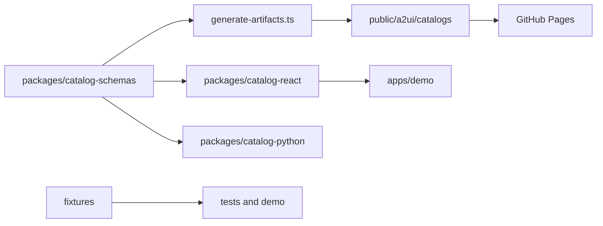

# AI37 A2UI Catalog

<!-- ai37:card:start (managed by doc-bot — do not edit inside) -->
# ai37-a2ui-catalog

## Описание

Монорепозиторий каталога A2UI для экосистемы AI-37: канонические Zod-схемы компонентов, React-рендереры, Pydantic-модели валидации, общие фикстуры и тесты. Артефакты каталога публикуются на GitHub Pages и используются для отрисовки и валидации A2UI-сообщений. С версии 0.23.0 в состав входит доменный компонент `ThermalReport`: карточный вывод результата теплотехнического расчёта по СП 50.13330 вместо markdown-простыни — вердикт с бейджем и headline, проверки со статусами или список конструкций с чипами отклонений и действиями, таблица слоёв с итоговой строкой, исходные данные чипами по источнику, допущения и свёрнутый «Протокол расчёта» с кратким текстовым выводом под катом и кнопкой «Скачать»; полная простыня (`downloadContent`) в чат не выводится, а скачивается клиентским Blob'ом.

## Стек

TypeScript, React 19, Zod, @a2ui/react (overrides: 0.10.1), Vite, Vitest, tsup, tsx, Python 3.13+ + Pydantic, Poetry 2.3.2, Twine, pnpm (>=10, packageManager pnpm@10.29.3), Node >=22. Версия пакетов workspace — 0.23.0. Публикация пакетов — в приватные реестры AI-37 (npm.app.sp-ai.ru и pypi.app.sp-ai.ru). Константа дебаунса автодрафта условий `CONDITIONS_DRAFT_DEBOUNCE_MS = 500` мс экспортируется из @ai37/a2ui-catalog-react.

## Схема работы

Workspace состоит из пакетов:
- packages/catalog-schemas — канонические Zod-схемы, метаданные каталога, генерация JSON Schema и артефактов каталога;
- packages/catalog-react — React-рендереры и регистрация компонентов в каталоге;
- packages/catalog-python — Pydantic-модели и валидация на стороне Python;
- apps/demo — Vite-приложение для ручной проверки A2UI-сообщений;
- fixtures — общие валидные, невалидные и сквозные фикстуры сообщений.

Поток данных: схемы → generate-artifacts.ts → catalog.json и component schemas → public/a2ui/catalogs → GitHub Pages. React-рендереры и Pydantic-модели подключаются к тем же компонентам; тесты и демо используют фикстуры.

`ThermalReport` зарегистрирован в обоих пакетах: zod-схема `components/thermal-report.ts` (strict-объекты; обязательны `verdict` и `inputs`, режим «одна конструкция / список» определяется по наличию секций без флага; единственное число в props — `deviationPct`, остальное — готовые строки) и рендерер `renderers/thermal-report*.tsx/.ts` (корень, verdict, checks, constructions, inputs, layers-table, protocol, styles, action-button, format-deviation-pct). Кнопки-действия диспатчат агенту `{event: {name, context: payload ?? {}}}` через `context.dispatchAction`; «Протокол расчёта» — нативный `
`, свёрнут по умолчанию, контент — краткий текстовый вывод (`content`) моноширинным `<pre>` без рендера (полная markdown-простыня в чат не попадает); при заданном `downloadFileName` кнопка «Скачать» отдаёт клиентским Blob'ом `downloadContent` (полную простыню; без него — `content`), не раскрывая протокол. Стили — `THERMAL_REPORT_CSS` с префиксом `a2ui-tr-`, цвета — токены группы `tr` (INHERITS на общие токены, как `ce`/`le`). Демо содержит два примера (одна конструкция / 7 конструкций), собранные из `fixtures/valid/thermal-report-*.json` через `create-thermal-report-messages.ts`; действия логируются `attachDemoActionLogger`.

## Структура каталогов

- apps/demo — Vite-приложение для ручной проверки A2UI-сообщений; dev-middleware мокает fetch-справочники lookup; логгеры черновиков/действий; примеры Thermal Report (single/multi) и помощник `create-thermal-report-messages.ts`;
- packages/catalog-schemas — канонические Zod-схемы, типы и генерация JSON Schema (включая `components/thermal-report.ts` и регистрацию в `CATALOG_COMPONENT_NAMES`, `constants.ts`, `catalog.ts`, `index.ts`);
- packages/catalog-react — React-рендереры компонентов каталога (в т.ч. `renderers/thermal-report*.tsx/.ts`, `thermal-report-protocol.tsx`, группа токенов `tr` в `tokens.ts`);
- packages/catalog-python — Pydantic-модели валидации (зеркало zod-схем);
- fixtures — валидные, невалидные и сквозные фикстуры A2UI-сообщений (включая `valid/thermal-report-single.json` и `valid/thermal-report-multi.json` — protocol содержит `content` и `downloadContent`);
- tests — тесты (tests/react — Vitest, включая `thermal-report.test.tsx`; tests/ts — включая `thermal-report-schema.test.ts`; python-часть — Pytest);
- public/a2ui/catalogs — статические артефакты каталога (catalog.json, JSON Schema компонентов, включая `components/thermal-report.schema.json`) для GitHub Pages;
- scripts/install-to-consumer.mjs — установка локальной сборки пакетов в потребителя тарболлами;
- .github/workflows — CI/CD (pages.yml, ci.yml, cd.yml);
- .npmrc — scoped-реестр @ai37 и авторизация для npm.app.sp-ai.ru;
- docs, openspec — документация и design-доки (включая openspec/changes/thermal-report и прежние changes).

## Публичные интерфейсы

Статический A2UI-каталог, публикуемый на GitHub Pages:
- catalog.json: https://ai-37.github.io/ai37-a2ui-catalog/a2ui/catalogs/ai37-a2ui/v2/catalog.json
- JSON Schema компонентов: .../a2ui/catalogs/ai37-a2ui/v2/components/*.schema.json (включая `thermal-report.schema.json`) и аналогично для v1.

Отдельных публичных HTTP/REST-эндпоинтов, A2A Agent Card (/a2a/v1), MCP-сервера, AG-UI-сервера и CLI наружу нет. Внутренний fetch-канал подсказок lookup-полей — same-origin `GET /api/agent-resource?resource=&query=` (resource = id справочника / `field.referenceId`; BFF потребителя проксирует на REST оркестратора). В dev-middleware apps/demo неизвестный resource — 404 `{error: "unknown_reference"}` (changelog 0.12.0 объявляет контрактный код `unknown_resource`). npm-пакеты workspace (catalog-schemas, catalog-react) публикуются в приватный npm-реестр AI-37 (npm.app.sp-ai.ru), Python-пакет ai37_a2ui_catalog — в приватный PyPI (pypi.app.sp-ai.ru); публичным наружу остаётся статический каталог на GitHub Pages.

В составе каталога v2 — компонент `ThermalReport` (read-mostly): секции `verdict` (обязателен), `checks`/`layersTable` (режим одной конструкции), `constructions`/`excluded`/`assumptions` (режим списка), `inputs` (обязателен), `protocol`. Действия — объект `{name, label, payload?}`; имя в схему не зашито, в фикстурах канонические `report_fix_construction` (payload `{constructionId}`), `report_edit_inputs`, `report_restore_excluded`. Чип отклонения форматируется самим рендерером по знаку `deviationPct`: «−23,3 %» / «+0,6 %» (типографский минус, десятичная запятая, один знак). Группа исходных данных с `tone: 'warning'` («принято системой — проверьте») отличается пунктирными чипами, предупреждающим заголовком и `note`. Протокол свёрнут по умолчанию: под катом — краткий текстовый вывод (`content`); «Скачать» при `downloadFileName` отдаёт `downloadContent` (полную markdown-простыню, maxLength 120000; без него — `content`) клиентским Blob'ом, не раскрывая протокол.

## Зависимости в экосистеме

### Зависит от

- npm-пакеты @a2ui/react и @a2ui/web_core (overrides: 0.10.1), а также workspace-пакеты: catalog-react зависит от catalog-schemas, demo — от catalog-react и catalog-schemas;
- React 19, Zod, Vite/Vitest, tsup, tsx;
- Python 3.13+, Pydantic, Poetry 2.3.2, Twine;
- при сборке/публикации — приватные реестры AI-37: npm.app.sp-ai.ru (npm) и pypi.app.sp-ai.ru (PyPI), а также токены AI37_NPM_TOKEN / AI37_PYPI_TOKEN;
- в fetch-режиме lookup — same-origin `/api/agent-resource`, который BFF потребителя проксирует на REST оркестратора (тот резолвит resource в ручку агента-владельца справочника);
- внешние сервисы (Authentik, LiteLLM, БД, Redis, S3) в рантайме не используются.

### От него зависят

По материалам репозитория прямые вызовы не перечислены; артефакты каталога предназначены для A2UI-потребителей экосистемы AI-37 (UI-рендереры и валидация сообщений). Рендерер ConstructionsEditor рассчитан на агента teplo-calc; proposal `constructions-editor-live-draft` отмечает потребителей spai-teplo-calc, spai-chat-backend и spai-ui — без изменений. Для слотов `group`/`title`/`meta` lookup-опций агент-справочник (например, spai-thermal-calc-agent) должен начать их отдавать; до этого рендер деградирует в однострочный `label`. Компонент `ThermalReport` рассчитан на агента spai-teplo-calc как эмитента отчёта (парный change `thermal-report` там) и на spai-ui как потребителя (bump schemas+react после publish).

## Конфигурация

Явного .env.example нет. Используются переменные окружения:
- AI37_NPM_TOKEN — токен авторизации для приватного npm-реестра npm.app.sp-ai.ru (задан в .npmrc и в CI/CD);
- AI37_PYPI_TOKEN — токен (password) для публикации Python-пакета через Twine на pypi.app.sp-ai.ru (в cd.yml).

Скоуп @ai37 закреплён за npm.app.sp-ai.ru в .npmrc (always-auth=true). Версии пакетов синхронизируются через `pnpm run version:bump <version>` (текущая версия — 0.23.0); каждый PR также обновляет CHANGELOG.md. Доступные npm-скрипты: pnpm run build, typecheck, test, test:ts, test:python, export:schemas, export:public, verify:public, lint, demo, version:bump, install:consumer. Константа `CONDITIONS_DRAFT_DEBOUNCE_MS = 500` мс экспортируется из @ai37/a2ui-catalog-react (не env; используется тестами и хостами для единого окна дебаунса). Конфигурация: package.json (включая overrides), tsconfig.base.json, vitest.config.ts, vite.config.ts, pyproject.toml. Тематизация рендереров — через CSS-переменные (tokens.ts), включая токены группы `tr` и общие статусные danger/success/warning для ThermalReport.

## Данные и хранилища

БД, Redis и S3 отсутствуют. Статические артефакты каталога: public/a2ui/catalogs/ai37-a2ui/v1 и v2 (в v2 `components/thermal-report.schema.json` и catalog.json перегенерированы с новым полем `downloadContent` у protocol). Фикстуры: fixtures/valid (включая thermal-report-single.json, thermal-report-multi.json — в protocol теперь `content` (краткий текстовый вывод) и `downloadContent` (полная markdown-простыня)), fixtures/invalid, fixtures/messages.

## Быстрый старт (локально)

Установка зависимостей:
- AI37_NPM_TOKEN должен быть доступен в окружении (см. .npmrc) — pnpm install обращается к npm.app.sp-ai.ru;
- `pnpm install` — зависимости workspace (pnpm >= 10, Node >= 22);
- `poetry -C packages/catalog-python install` — Python-пакет ai37-a2ui-catalog.

.env.example отсутствует — других env-переменных нет. Отдельного health-check нет; smoke-проверка после установки — `pnpm run test`. Демо-приложение: `pnpm run demo` (Vite + dev-middleware с мок-справочниками) для ручной проверки A2UI-сообщений; в демо доступны примеры Thermal Report — одна конструкция и список из 7 конструкций (действия видны в консоли). Локальная проверка в потребителе без публикации: `pnpm run install:consumer [путь]` (по умолчанию ../spai-ui) — собирает тарболлы пакетов и ставит их в consumer через npm install --no-save.

## Как запускать тесты

Предварительно: `pnpm install` и `poetry -C packages/catalog-python install`.
- `pnpm run test` — vitest + pytest;
- `pnpm run test:ts` — только TypeScript/React-тесты (включая constructions-editor.test.tsx, lookup-option-rich-render.test.tsx, thermal-report.test.tsx, thermal-report-schema.test.ts, parse-lookup-options.test.ts);
- `pnpm run test:python` — только Python-тесты;
- `pnpm run lint` — typecheck.

## Деплой

GitHub Actions:
- .github/workflows/pages.yml публикует статические артефакты (включая обновлённые v2 с thermal-report.schema.json) на GitHub Pages;
- .github/workflows/ci.yml — CI-проверки (Reuse CI), при pnpm install используется AI37_NPM_TOKEN;
- .github/workflows/cd.yml — CD на push тегов v* или workflow_dispatch:
  - publish_npm: pnpm build и публикация @ai37/a2ui-catalog-* в приватный реестр https://npm.app.sp-ai.ru/ (токен AI37_NPM_TOKEN);
  - publish_pypi: poetry build + twine check dist/* + twine upload в https://pypi.app.sp-ai.ru/ (TWINE_USERNAME=ci-publish, TWINE_PASSWORD=AI37_PYPI_TOKEN). Poetry 2.3.2 ставится до setup-python (cache: poetry); run-шаги выполняются из packages/catalog-python.

Публичный хост: https://ai-37.github.io/ai37-a2ui-catalog/. Terraform/helm не используются.

## Связанные документы

- ecosystem/v2/10-agui-protocol.md — протокол AG-UI/A2UI, в контексте которого существует каталог;
- docs/theming.md;
- docs/initial-plan.md;
- openspec/changes/constructions-editor-live-draft/design.md, proposal.md, specs/constructions-editor-draft/spec.md, tasks.md;
- openspec/changes/lookup-option-rich-render/design.md, proposal.md, specs/lookup-option-rich-render/spec.md, specs/form-card-lookup-fetch-mode/spec.md;
- openspec/changes/form-card-dispatch-action/design.md;
- openspec/changes/pending-nav-single-open/design.md, proposal.md, specs/constructions-editor-pending-nav/spec.md, tasks.md;
- openspec/changes/instant-rpr-recalc/design.md, proposal.md, specs/constructions-editor-inline-layers/spec.md, specs/constructions-editor-rpr-preview/spec.md, tasks.md;
- openspec/changes/thermal-report/design.md;
- openspec/changes/thermal-report/proposal.md;
- openspec/changes/thermal-report/specs/thermal-report-component/spec.md;
- openspec/changes/thermal-report/tasks.md.
<!-- ai37:card:end -->

<!-- Ниже — только уникальный человеческий контекст (замысел, инварианты, грабли).
     Не дублируйте сюда «что/как» из карточки выше — её ведёт docs-bot из кода. -->

## Adding Components

1. Add the canonical Zod schema in `packages/catalog-schemas/src/components/<component>.ts`.
2. Export the new definition from `packages/catalog-schemas/src/index.ts` and register it in `packages/catalog-schemas/src/catalog.ts` so it appears in `componentDefinitions` and the exported catalog artifact.
3. Add the React renderer in `packages/catalog-react/src/renderers/<component>.tsx` and register it from `packages/catalog-react/src/catalog.ts`.
4. Add the manual Pydantic model in `packages/catalog-python/src/ai37_a2ui_catalog/models/<component>.py`, then export it from `packages/catalog-python/src/ai37_a2ui_catalog/models/__init__.py` and `packages/catalog-python/src/ai37_a2ui_catalog/__init__.py` when it is part of the public API.
5. Add or update fixtures in `fixtures/messages` so the new component has realistic surface messages for tests and local verification.
6. Run `pnpm run test`, `pnpm run build`, and if you changed exported schemas also run `pnpm run export:schemas -- --output ./tmp/catalog-public`.

## Versioning

The repository uses a synchronized version for npm packages, the Python package, and the catalog artifacts. Use `pnpm run version:bump <version>` to update the tracked manifest versions in one pass.

Every pull request is expected to do two release bookkeeping updates together with the code change:

- bump the synchronized version before merge
- add a matching entry to `CHANGELOG.md` using the heading format `## [x.y.z] - YYYY-MM-DD`
