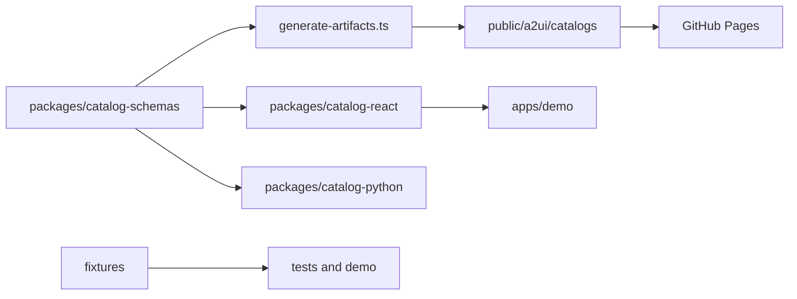

# AI37 A2UI Catalog

<!-- ai37:card:start (managed by doc-bot — do not edit inside) -->
# ai37-a2ui-catalog

## Описание
Монорепозиторий каталога A2UI для экосистемы AI-37: канонические Zod-схемы компонентов, React-рендереры, Pydantic-модели валидации, общие фикстуры и тесты. Артефакты каталога публикуются на GitHub Pages и используются для отрисовки и валидации A2UI-сообщений.

## Стек
TypeScript, React 19, Zod, @a2ui/react (overrides: 0.10.1), Vite, Vitest, tsup, tsx, Python 3 + Pydantic, Poetry 2.3.2, Twine, pnpm (>=10), Node >=22. Публикация пакетов — в приватные реестры AI-37 (npm.app.sp-ai.ru и pypi.app.sp-ai.ru).

## Схема работы
Workspace состоит из пакетов:
- packages/catalog-schemas — канонические Zod-схемы, метаданные каталога, генерация JSON Schema и артефактов каталога;
- packages/catalog-react — React-рендереры и регистрация компонентов в каталоге;
- packages/catalog-python — Pydantic-модели и валидация на стороне Python;
- apps/demo — Vite-приложение для ручной проверки A2UI-сообщений;
- fixtures — общие валидные, невалидные и сквозные фикстуры сообщений.

Поток данных: схемы → generate-artifacts.ts → catalog.json и component schemas → public/a2ui/catalogs → GitHub Pages. React-рендереры и Pydantic-модели подключаются к тем же компонентам; тесты и демо используют фикстуры.

## Структура каталогов
- apps/demo — Vite-приложение для ручной проверки A2UI-сообщений; dev-middleware мокает fetch-справочники lookup;
- packages/catalog-schemas — канонические Zod-схемы, типы и генерация JSON Schema;
- packages/catalog-react — React-рендереры компонентов каталога (в т.ч. ConstructionsEditor);
- packages/catalog-python — Pydantic-модели валидации (зеркало zod-схем);
- fixtures — валидные, невалидные и сквозные фикстуры A2UI-сообщений;
- tests — тесты (tests/react — Vitest; python-часть — Pytest);
- public/a2ui/catalogs — статические артефакты каталога (catalog.json, JSON Schema компонентов) для GitHub Pages;
- .github/workflows — CI/CD (pages.yml, ci.yml, cd.yml);
- .npmrc — scoped-реестр @ai37 и авторизация для npm.app.sp-ai.ru;
- docs, openspec — документация и design-доки.

## Публичные интерфейсы
Статический A2UI-каталог, публикуемый на GitHub Pages:
- catalog.json: https://ai-37.github.io/ai37-a2ui-catalog/a2ui/catalogs/ai37-a2ui/v1/catalog.json
- JSON Schema компонентов: .../a2ui/catalogs/ai37-a2ui/v1/components/*.schema.json и аналогично для v2.

Отдельных HTTP/REST-эндпоинтов, A2A Agent Card (/a2a/v1), MCP-сервера, AG-UI-сервера и CLI наружу нет. npm-пакеты workspace (catalog-schemas, catalog-react) публикуются в приватный npm-реестр AI-37 (npm.app.sp-ai.ru), Python-пакет ai37_a2ui_catalog — в приватный PyPI (pypi.app.sp-ai.ru); публичным наружу остаётся статический каталог на GitHub Pages.

В составе @ai37/a2ui-catalog-react — рендерер ConstructionsEditor (редактор конструкций): наружу один submit с полным состоянием {general, constructions} (без клиентской блокировки); при заданном пропе draftAction черновик с тем же payload уходит по явным коммитам состояния конструкций — add/remove конструкции, «Применить»/«Добавить»/«Удалить слой» формы слоя («Применить» без изменений действия не порождает). Слои — строки-сводки («№ · материал · толщина · λ»), форма правки одна на редактор и коммитит локальную копию в state; невалидные конструкции подсвечиваются пометкой «! проверить» — индикация, не блок.

## Зависимости в экосистеме
### Зависит от
- npm-пакеты @a2ui/react и @a2ui/web_core (overrides: 0.10.1);
- React 19, Zod, Vite/Vitest, tsup, tsx;
- Python 3, Pydantic, Poetry 2.3.2, Twine;
- при сборке/публикации — приватные реестры AI-37: npm.app.sp-ai.ru (npm) и pypi.app.sp-ai.ru (PyPI), а также токены AI37_NPM_TOKEN / AI37_PYPI_TOKEN;
- внешние сервисы (Authentik, LiteLLM, БД, Redis, S3) в рантайме не используются.

### От него зависят
По материалам репозитория прямые вызовы не перечислены; артефакты каталога предназначены для A2UI-потребителей экосистемы AI-37 (UI-рендереры и валидация сообщений). Рендерер ConstructionsEditor рассчитан на агента teplo-calc (приём submit/draftAction с состоянием конструкций).

## Конфигурация
Явного .env.example нет. Используются переменные окружения:
- AI37_NPM_TOKEN — токен авторизации для приватного npm-реестра npm.app.sp-ai.ru (задан в .npmrc и в CI/CD);
- AI37_PYPI_TOKEN — токен (password) для публикации Python-пакета через Twine на pypi.app.sp-ai.ru (в cd.yml).

Скоуп @ai37 закреплён за npm.app.sp-ai.ru в .npmrc (always-auth=true). Версии пакетов синхронизируются через pnpm run version:bump <version>; каждый PR также обновляет CHANGELOG.md. Конфигурация: package.json (включая overrides), tsconfig.base.json, vitest.config.ts, vite.config.ts, pyproject.toml. Тематизация рендереров — через CSS-переменные (tokens.ts), включая токен --a2ui-color-warning для подсветки невалидных конструкций.

## Данные и хранилища
БД, Redis и S3 отсутствуют. Статические артефакты каталога: public/a2ui/catalogs/ai37-a2ui/v1 и v2. Фикстуры: fixtures/valid, fixtures/invalid, fixtures/messages.

## Быстрый старт (локально)
Установка зависимостей:
- AI37_NPM_TOKEN должен быть доступен в окружении (см. .npmrc) — pnpm install обращается к npm.app.sp-ai.ru;
- pnpm install — зависимости workspace (pnpm >= 10, Node >= 22);
- poetry -C packages/catalog-python install — Python-пакет ai37-a2ui-catalog.

.env.example отсутствует — других env-переменных нет. Отдельного health-check нет; smoke-проверка после установки — pnpm run test. Демо-приложение apps/demo (Vite + dev-middleware с мок-справочниками) служит для ручной проверки A2UI-сообщений.

## Как запускать тесты
Предварительно: pnpm install и poetry -C packages/catalog-python install.
- pnpm run test — vitest + pytest;
- pnpm run test:ts — только TypeScript/React-тесты;
- pnpm run test:python — только Python-тесты;
- pnpm run lint — typecheck.

## Деплой
GitHub Actions:
- .github/workflows/pages.yml публикует статические артефакты на GitHub Pages;
- .github/workflows/ci.yml — CI-проверки (Reuse CI), при pnpm install используется AI37_NPM_TOKEN;
- .github/workflows/cd.yml — CD на push тегов v* или workflow_dispatch:
  - publish_npm: pnpm build и публикация @ai37/a2ui-catalog-* в приватный реестр https://npm.app.sp-ai.ru/ (токен AI37_NPM_TOKEN);
  - publish_pypi: poetry build + twine check dist/* + twine upload в https://pypi.app.sp-ai.ru/ (TWINE_USERNAME=ci-publish, TWINE_PASSWORD=AI37_PYPI_TOKEN). Poetry 2.3.2 ставится до setup-python (cache: poetry); run-шаги выполняются из packages/catalog-python.

Публичный хост: https://ai-37.github.io/ai37-a2ui-catalog/. Terraform/helm не используются.

## Связанные документы
- ecosystem/v2/10-agui-protocol.md — протокол AG-UI/A2UI, в контексте которого существует каталог;
- docs/theming.md;
- docs/initial-plan.md;
- openspec/changes/form-card-dispatch-action/design.md.
<!-- ai37:card:end -->

<!-- Ниже — только уникальный человеческий контекст (замысел, инварианты, грабли).
     Не дублируйте сюда «что/как» из карточки выше — её ведёт docs-bot из кода. -->

## Adding Components

1. Add the canonical Zod schema in `packages/catalog-schemas/src/components/<component>.ts`.
2. Export the new definition from `packages/catalog-schemas/src/index.ts` and register it in `packages/catalog-schemas/src/catalog.ts` so it appears in `componentDefinitions` and the exported catalog artifact.
3. Add the React renderer in `packages/catalog-react/src/renderers/<component>.tsx` and register it from `packages/catalog-react/src/catalog.ts`.
4. Add the manual Pydantic model in `packages/catalog-python/src/ai37_a2ui_catalog/models/<component>.py`, then export it from `packages/catalog-python/src/ai37_a2ui_catalog/models/__init__.py` and `packages/catalog-python/src/ai37_a2ui_catalog/__init__.py` when it is part of the public API.
5. Add or update fixtures in `fixtures/messages` so the new component has realistic surface messages for tests and local verification.
6. Run `pnpm run test`, `pnpm run build`, and if you changed exported schemas also run `pnpm run export:schemas -- --output ./tmp/catalog-public`.

## Versioning

The repository uses a synchronized version for npm packages, the Python package, and the catalog artifacts. Use `pnpm run version:bump <version>` to update the tracked manifest versions in one pass.

Every pull request is expected to do two release bookkeeping updates together with the code change:

- bump the synchronized version before merge
- add a matching entry to `CHANGELOG.md` using the heading format `## [x.y.z] - YYYY-MM-DD`
