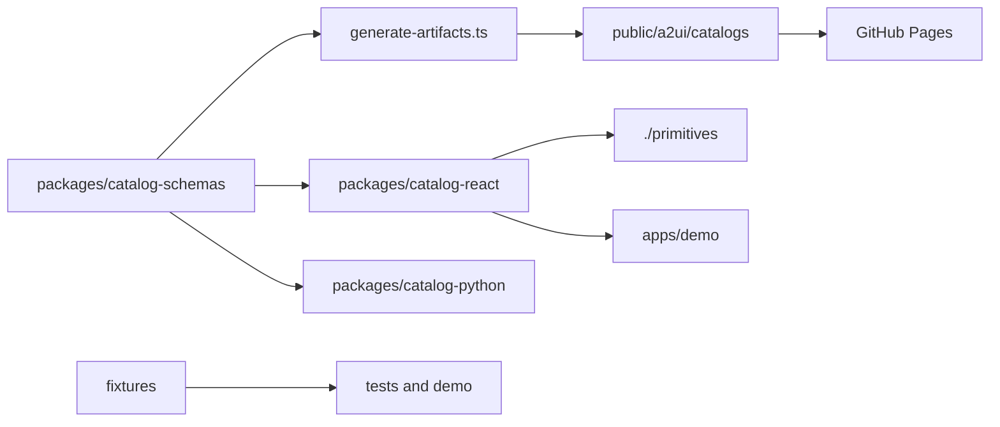

# AI37 A2UI Catalog

<!-- ai37:card:start (managed by doc-bot — do not edit inside) -->
# ai37-a2ui-catalog

## Описание

Монорепозиторий каталога A2UI для экосистемы AI-37: канонические Zod-схемы компонентов, React-рендереры, Pydantic-модели валидации, общие фикстуры и тесты. Артефакты каталога публикуются на GitHub Pages и используются для отрисовки и валидации A2UI-сообщений. В составе — доменные карточки результатов расчётов (`ThermalReport`, `LiftReport`, `KeoReport`, `InsolationReport`), редакторы исходных данных (`ConstructionsEditor`/`ConstructionsEditorNext`, `LiftEditor`/`LiftEditorNext`, `KeoEditor`/`KeoEditorNext`, `InsolationEditor`), карточка артефакта агента (`ArtifactCard`) и набор переиспользуемых UI-примитивов (`@ai37/a2ui-catalog-react/primitives`). `ArtifactCard` — карточка результата хода, сохранённого в выходной полке chat-backend (`/api/artifacts`): имя, мета и меню «Скачать» (Word/Markdown и бинарные файлы), а «Сохранить в проект» — вызов хоста, а не A2UI-действие агенту.

## Стек

TypeScript, React 19, Zod (zod-to-json-schema), @a2ui/react / @a2ui/web_core (overrides: 0.10.1), @base-ui/react ^1.7.0 (поведение UI), katex, Vite, Vitest, tsup, tsx, Python 3.13+ + Pydantic, Poetry 2.3.2, Twine, pnpm (>=10, packageManager pnpm@10.29.3), Node >=22. Версия пакетов workspace — 0.39.0 (`package.json`, `apps/demo/package.json`, `packages/catalog-schemas/package.json`, `packages/catalog-react/package.json`, `packages/catalog-python/pyproject.toml`, `packages/catalog-python/uv.lock`). Публикация пакетов — в приватные реестры AI-37 (npm.app.sp-ai.ru и pypi.app.sp-ai.ru). Константы дебаунса автодрафта условий: `CONDITIONS_DRAFT_DEBOUNCE_MS = 500` мс (@ai37/a2ui-catalog-react), `LIFT_DRAFT_DEBOUNCE_MS = 500` мс.

## Схема работы

Workspace состоит из пакетов:
- packages/catalog-schemas — канонические Zod-схемы, метаданные каталога, генерация JSON Schema и артефактов каталога;
- packages/catalog-react — React-рендереры и регистрация компонентов в каталоге; подпуть экспорта `./primitives` — набор примитивов каталога: токены слоями (`--a2ui-text-*`, `--a2ui-btn-*`, `--a2ui-card-*`), `Button`, `Card`, `Chip` (в т.ч. `tone="warning"` и `tone="neutral"`), три ступени текста, `Form`/`Field`/`Input`/`Static`, обёртки над Base UI (`Lookup` на `Autocomplete`, `Select`, `NumberField`, `Menu` с `trigger="link"` и `side="top"`), `SectionItem`, `SummaryCollapsible`, `Combo`, `SourceNote`, `KitStyles`, а также примитивы отчётов: `ReportRow`, `DataChip`, `StatusPill`, `ReportHeadline` (ступень `display` с осью `--a2ui-font-serif`), `ReportTable`, `ReportNote`, `ReportProtocolCard`; корень набора — класс `a2ui-kit`, пороги колонок `FORM_TWO_COLUMNS_AT = 500`, `FORM_THREE_COLUMNS_AT = 620`;
- packages/catalog-python — Pydantic-модели и валидация на стороне Python;
- apps/demo — Vite-приложение для ручной проверки A2UI-сообщений; витрина примитивов — `/proba/system`;
- fixtures — общие валидные, невалидные и сквозные фикстуры сообщений.

Поток данных: схемы → generate-artifacts.ts → catalog.json и component schemas → public/a2ui/catalogs → GitHub Pages. React-рендереры и Pydantic-модели подключаются к тем же компонентам; тесты и демо используют фикстуры.

Доменные компоненты (catalog v2, набор расширяется аддитивно):
- отчёты: `ThermalReport`, `LiftReport`, `KeoReport`, `InsolationReport` — вердикт, рекомендации/проверки, исходные данные по источникам, протокол; для `ThermalReport` и `LiftReport` рядом зарегистрированы `ThermalReportNext`/`LiftReportNext` на наборе примитивов — те же схемы props (`thermalReportPropsSchema`, `liftReportPropsSchema`) и тот же контракт действий (`{event: {name, context: payload ?? {}}}`), своих листов стилей у них нет;
- редакторы: `ConstructionsEditor` (+ рядом `ConstructionsEditorNext`, та же схема props `constructionsEditorPropsSchema`), `LiftEditor` (+ рядом `LiftEditorNext`, та же схема props `liftEditorPropsSchema`), `KeoEditor`/`KeoEditorNext` (общая схема `keoEditorPropsSchema`), `InsolationEditor` — один submit с документом, live-черновик с дебаунсом, индикация без блокировки; Next-версии построены на примитивах и регистрируются рядом со старыми для сравнения «было/стало»; контракт данных не меняется;
- `ArtifactCard` (0.39.0, план `files-and-artifacts-layer` §3.3, фаза 3) — карточка артефакта агента.

`ArtifactCard` (0.39.0):
- контракт — `artifactCardPropsSchema` (strict): обязательны `artifactId` (uuid-паттерн `^[0-9a-fA-F]{8}-[0-9a-fA-F]{4}-[0-9a-fA-F]{4}-[0-9a-fA-F]{4}-[0-9a-fA-F]{12}$`) и `name` (1..200); опциональны `kind` (1..64, тип домена), `meta` (1..200, готовая строка меты), `summary` (1..500), `scope` (`chat` | `project`), `formats` (массив `'docx'`/`'md'`, максимум 2) и `files` (массив `{id, fileName (1..255), label? (1..80)}`, максимум 20). Паттерн, а не `z.string().uuid()`, — чтобы JSON Schema получила `pattern`, один в один повторяющий Pydantic-зеркало; href в props нет вовсе, ссылки рендерер собирает сам из id, поэтому агент не может подсунуть ссылку наружу. Python-зеркало — `models/artifact_card.py` (`ArtifactCardProps`, `ArtifactCardFile`, `ArtifactCardFormat`, `ARTIFACT_ID_PATTERN`), `ArtifactCard` в `COMPONENT_MODELS`;
- рендерер `renderers/artifact-card.tsx` — `createComponentImplementation(artifactCardDefinition, …)`, экран вынесен отдельно (`renderers/artifact-card-screen.tsx`) на примитивах набора: одна строка `ReportProtocolCard` с именем, метой и действиями справа; мета — `meta`, иначе `summary`, иначе `kind` (`artifactMeta`). Меню «Скачать» (`Menu side="top"`) есть только когда есть пункты: выгрузки из markdown (`formats`, по умолчанию оба) и файлы артефакта; `formats: []` и нет файлов — меню нет;
- ссылки — `renderers/artifact-card-links.ts`: база по умолчанию `DEFAULT_ARTIFACTS_BASE_URL = '/api/artifacts'`, хост может задать свою только путём от корня (`safeArtifactsBaseUrl` отвергает схему, `//host`, бэкслеш, управляющие символы и `..`, откатываясь на дефолт и срезая хвостовые слэши). Пункты меню — ссылки: `<base>/<artifactId>/content?format=docx|md` и `<base>/<artifactId>/files/<fileId>`; id экранируются `encodeURIComponent`; download-заголовки ставит сервер;
- «Сохранить в проект» — вызов хоста, а не A2UI-действие агенту (агенту в этом ходе делать нечего, прикрепление идёт в chat-backend). Хост передаёт `baseUrl` и `onSaveToProject` через `ArtifactCardHostProvider` (`renderers/artifact-card-host.tsx`, `useArtifactCardHost`): без `onSaveToProject` кнопки нет (например, тред вне проекта или widget-канал). Состояния: `Сохраняю…` → `В проекте`, ошибка хоста — `Не удалось сохранить` (`role="status"`) и кнопка остаётся; `scope: 'project'` сразу показывает «В проекте», кнопки нет даже с хостом;
- регистрация: `CATALOG_COMPONENT_NAMES` и `catalog.ts` в catalog-schemas (`artifactCardDefinition`), `catalog.ts` в catalog-react (`ArtifactCard` в `customComponents`), `COMPONENT_MODELS` в catalog-python. Изменение аддитивное, `CATALOG_VERSION` остаётся `v2`;
- текстовый fallback — обязанность агента: описание компонента требует сопровождать карточку markdown-ссылкой на `/api/artifacts/<id>` для клиентов, которые каталог не рендерят.

Правило зависимостей лифтов умеет ставить подпись под полем (0.37.0, change `lift-editor-note-rules`, срез B плана `fix-lift-min-speed-sp54-warning`): строка `dependentRules[].rows[]` получила опциональный `note: {field, text (1–160), tone?: 'muted' | 'warning'}` (`tone` по умолчанию `warning`), а `set` стал опциональным; строка без `set` и без `note` отвергается схемой. Совпадение считается как у `set` — первая строка правила, чей `when` совпал со значениями `sources` в порядке объявления (числа сравниваются численно: '1' = 1 = '1,0'), в том числе кросс-секционно (`scope: 'building'`: N из «Здания» + Vн лифта). Подписи собирает `collectRuleNotes(rules, building, lift)` из ТЕКУЩИХ значений секции лифта после подстановок; на одно поле побеждает первое правило, внутри правила — первая совпавшая строка. Оба рендерера (`LiftEditor` и `LiftEditorNext`) показывают подпись правила под полем с приоритетом note → источник → hint. Правка поля подпись не «снимает». Подписи заводятся только для полей секций лифта. Первый потребитель — предупреждение «скорость ниже минимума СП 54 прил. В» в агенте лифтов; строки нормативной таблицы СП 54 в каталоге не живут — их эмитит агент. `collectRuleTargets` и `applyDependentRules` читают `row.set ?? {}`. В наборе примитивов предупреждение получает роль `status`, тон — `a2ui-t--warning` / `a2ui-t--muted`; в прежнем рендерере — `a2ui-le-caption--warning` / `a2ui-le-caption--muted`.

Вид слоя `thin` и толщина у зазоров (0.38.0, change `constructions-layer-kind-thin`, план `AI-37/docs#405`, парный change агента `verify-thin-layers`):
- контракт — `constructionLayerKindSchema` принимает `thin` — тонкий нетепловой слой (плёнка, клеевой состав, сетка, краска): λ не бывает, Rs = 0 считает сервер; Python-зеркало — `ConstructionLayerKind = Literal["material", "vent-gap", "closed-gap", "thin"]`;
- форма слоя `ConstructionsEditorNext` получила селектор «Вид слоя» (`ConstructionsNextKindField` поверх примитивов `Field` + `Select`): материал / вентилируемый зазор / замкнутый зазор / тонкий слой. Подписи и пункты — `LAYER_KIND_LABELS` / `LAYER_KIND_ITEMS` (`layer-kind-labels.ts`). Смена вида на не-материал снимает `materialKey`, `lambdaA`, `lambdaB` и `lambdaManual`; при `kind === 'material'` ключ `kind` снимается со слоя;
- спец-запись справочника материалов, чьё `value` равно виду (`vent-gap`, `closed-gap`, `thin`), ставит `kind` сразу при выборе опции (`layerKindFromOption`); строка прил. М (`m…`) даёт `undefined`;
- толщина не нужна у `vent-gap` и `thin` (`layerNeedsThickness` — зеркало серверного): поле `NumberField` остаётся с плейсхолдером «не нужна», нижняя граница `min=1` сохранена — схема принимает только положительную толщину либо `null`. В строке-сводке у таких слоёв без толщины печатается приглушённое «без толщины»;
- сводка строки (`ConstructionsNextLayerSummary`) печатает подпись вида под названием у всех не-материалов; λ в сводке — пятью ветками: у `thin` «не учитывается», у зазоров «Rs — в итоговом расчёте», далее ручная λ, λ из справочника с пометкой «авто» и пустая λ предупреждающим цветом. Поле λ в форме различает те же ветки: у `thin` — `Static` «не учитывается»;
- прежний `ConstructionsEditor` не тронут: `isGap = kind !== 'material'` читает `thin` как зазор — не падает и λ не просит; селектора вида у него нет.

Для `KeoEditorNext` добавлен optional `draftUrl` (спайк `keo-draft-rest-channel`): при заданном URL черновик уезжает fetch POST'ом по цепочке `/api/agent-resource` вместо диалогового `dispatchAction`. Ответ агента несёт `notes` по имени условия и применяется локально оверрайдом поверх `props.conditions[].note`; эха формы в этом канале нет. На монтировании GET того же ресурса сеет форму сохранённым черновиком (`{draft: ...}`). `draftAction` остаётся путём отката. Ключ аддитивный, поддержку канала реализует только `KeoEditorNext`.

REST-канал реализован хуком `useKeoDraftPost` и хелпером `applyKeoDraftSeed`: отдельные `AbortController` для POST и GET, смена снапшота сбрасывает оверрайды и посев и абортит оба запроса, поздний ответ сверяется с `signal.aborted`, сбой канала — тихий fallback; `applyKeoDraftSeed` берёт из черновика значения, метки источников — из props; ключ пересева `propsKey` в `useKeoEditorNext` исключает `note` условий.

Submit во всех редакторах уходит прежним диалоговым контрактом `{event: {name, context: document}}`; для `KeoEditorNext` с `draftUrl` REST-канал используется только для черновика.

Контролы полей редакторов: общий стиль текстовых инпутов/селектов (`inputStyle` в `renderers/shared.ts`, алиас `controlStyle`) включает `width: 100%` и `box-sizing: border-box`; чекбоксы boolean-полей (`CalcEditorField`, `LiftEditorField`) выставляют `alignSelf: 'start'`. Строка подписи под полем лифта одна: подпись правила (`note`), иначе источник, иначе `hint`. Сетка формы слоя `ConstructionsNextLayerForm` — `Form columns={3}`: материал забирает строку (`Field wide`), вид, толщина и λ встают второй строкой.

Невалидность карточки конструкции вычисляется на клиенте в `renderers/find-invalid-layers.ts` (`ConstructionInvalidity`, считается на каждый рендер): это индикация, не блок. Пять причин: слой без λ, слой без положительной толщины, пустое название материала, тип без слоёв без введённого паспортного `rprPassport` (`missingPassport`) и незаполненная разновидность у типа, которому она обязательна (`missingSubtype`). Обязательность разновидности выводится из конфига типа, присланного агентом (`renderers/is-subtype-required.ts`: `typeof config?.alphaN === 'object'`). При `missingSubtype` поле `missingLambdaCount` обнуляется, карточка получает красную рамку (`a2ui-card--invalid`). В шапке раскрытой карточки `ConstructionsNextHeaderSummary` печатает « · разновидность не выбрана» предупреждающим оформлением. Не-материалы (зазоры и `thin`) клиентская валидация толщиной не проверяет.

Коэффициент теплотехнической однородности r (Г.4 СП 50.13330.2024; change `constructions-editor-r`, план `thermal-r-uniformity-sp230`, этап A): `ConstructionEntry.r` — опциональное число (0; 1] (`z.number().gt(0).max(1).optional()`, Python `r: float = Field(default=None, gt=0, le=1)`). Отсутствие ключа означает «r не задан»: клиент дефолт не подставляет — агент считает с r = 1 и помечает это допущением. Поле «r (однородность)» живёт в форме шапки карточки `ConstructionsEditorNext` и показывается только у типов с `hasLayers`; значение уходит наверх только по «Сохранить» (`headerFieldsEqual` сравнивает r), смена типа на изделие сбрасывает r (`next-header-draft-for-type.ts`), очищенное поле снимает ключ (`withHeaderFields`). Контрол — `NumberField` с `min=0.01`, `max=1`, `step=0.01` и плейсхолдером «1». Сводка шапки печатает `· r = 0.85` (`toFixed(2)`). Live-Rпр слоистой конструкции — `Rпр = r · (1/αв + 1/αн + Σ δ/λ)`, без r — на 1 (`computeLiveRpr`).

Температура помещения по конструкции и поправка nt (формула (5.3) СП 50.13330.2024; change `constructions-editor-nt`, план `thermal-nt-room-temperature`):
- контракт — `ConstructionEntry.tvRoom` (tв*) и `ConstructionEntry.totRoom` (tот*), оба опциональные числа без диапазона (`tvRoom: z.number().optional()`, `totRoom: z.number().optional()`; Python: `tvRoom: float = None`, `totRoom: float = None`). Незаданное выражается отсутствием ключа: strict-схема отвергает явный `null` (`fixtures/invalid/constructions-editor-tv-room-null.json`);
- расчёт — чистые функции `renderers/compute-nt.ts` и `renderers/effective-rnorm.ts`: `nt = (tв* − tот*) / (tв − tот)`, `Rнорм = Rтр · nt`. Незаданная температура берётся общей по зданию (`ConstructionsClimateBase = {tv, tot}` из блока «Условия»); `computeNt` возвращает `null`, когда не задана ни одна температура конструкции, когда климат здания неполон и когда пара не даёт положительного результата;
- норма сравнения — `effectiveRnorm(config.rnorm, nt)`: базовое `rnorm` типа есть значение при nt = 1, поправку по конструкции накладывает клиент; так считают и чип Rпр, и счётчик «проходит N из M»;
- чип — `renderers/constructions-next-nt-chip.tsx`: `Chip tone="neutral"` с `nt.toFixed(2)` рядом с чипом Rпр;
- поля формы шапки — `renderers/constructions-next-room-temp-field.tsx` (`Field` + `NumberField`, `step={0.1}`, без границ) показываются у ЛЮБОГО типа, включая окна и двери: nt правит норму таблицы 3, а не Rпр. Плейсхолдер — значение здания; правки уходят наверх только по «Сохранить» (`headerFieldsEqual` сравнивает `tvRoom`/`totRoom`), очищенное поле снимает ключ, смена типа на изделие температуры сохраняет. Сводка шапки печатает `· t в +16 °C` / `· t от +8 °C`. `ConstructionsClimateBase` прокинут из `ConstructionsEditorNext` в список и карточку. Схема props общая со старым рендерером.

`ThermalReport` зарегистрирован в обоих пакетах: zod-схема `components/thermal-report.ts` (strict-объекты; обязательны `verdict` и `inputs`) и рендерер `renderers/thermal-report*.tsx/.ts`. Кнопки-действия диспатчат агенту `{event: {name, context: payload ?? {}}}` через `context.dispatchAction`; «Протокол расчёта» — одна неразворачиваемая строка: лейбл, meta и при `downloadFileName` кнопка «Скачать». «Скачать» отдаёт клиентским Blob'ом `downloadContent` (без него — `content`); без `downloadFileName` кнопка не рендерится. Стили — `THERMAL_REPORT_CSS` с префиксом `a2ui-tr-`. Демо содержит два примера, собранные из `fixtures/valid/thermal-report-*.json` через `create-thermal-report-messages.ts`; действия логируются `attachDemoActionLogger`.

`LiftReport` зарегистрирован в zod-каталоге и React-каталоге: zod-схема `components/lift-report.ts` и рендерер `renderers/lift-report*.tsx/.ts`. Секции: `verdict` (статусный бейдж с точкой, serif-headline, опциональный `summary`); `suggestions` («Что изменить») — варианты с пересчитанным `detail`, элемент с `action` рендерит кнопку «Пересчитать», без `action` — `statusLabel` тоном; `inputs` — контракт идентичен `ThermalReport.inputs`; `protocol` — нативный `
`, свёрнутый по умолчанию, при заданном `downloadUrl` рендерится ссылка «Скачать». Действия диспатчатся как `{event: {name, context: payload ?? {}}}`; канонические имена в фикстуре — `report_apply_suggestion` и `report_edit_inputs`. Стили — `LIFT_REPORT_CSS` с префиксом `a2ui-lr-`.

`ThermalReportNext`/`LiftReportNext` собраны из того же набора примитивов, принимают те же схемы props и диспатчат действия тем же контрактом. Их протокол — одна строка без раскрытия, «Скачать ⌄» — один триггер на оба отчёта: список форматов зависит от наполнения (`.md`+`.docx` при `downloadUrl`, один `.md` при клиентском Blob'е). Статус строки и вердикт — одна пилюля (`StatusPill`).

Протоколы отчётов: общий `DownloadFormatMenu` + хелпер `agentResourceConvertUrl` — кнопка «Скачать ▾» с выбором формата: `.md` — прямая ссылка на `downloadUrl` (`/api/agent-resource`, прод-поведение), `.docx` — конверт-сервис chat-backend (`/api/agent-resource/convert?format=docx`).

```mermaid
flowchart LR
    S[packages/catalog-schemas] --> G[generate-artifacts.ts]
    G --> P[public/a2ui/catalogs]
    P --> GH[GitHub Pages]
    S --> R[packages/catalog-react]
    S --> Py[packages/catalog-python]
    R --> Pr[./primitives]
    F[fixtures] --> T[tests and demo]
    R --> D[apps/demo]
```

## Структура каталогов

- apps/demo — Vite-приложение для ручной проверки A2UI-сообщений; dev-middleware мокает fetch-справочники lookup; логгеры черновиков/действий; примеры Thermal Report (single/multi), Lift Report, Next-редакторов (включая превью `lift-note-rule-preview` — подпись правила СП 54); витрина примитивов `/proba/system`;
- packages/catalog-schemas — канонические Zod-схемы, типы и генерация JSON Schema (включая `components/artifact-card.ts` — `artifactCardPropsSchema`, `ARTIFACT_ID_PATTERN`, `artifactCardFileSchema`, `artifactCardFormatSchema`, `artifactCardDefinition`; `components/keo-editor.ts`, `components/thermal-report.ts`, `components/lift-report.ts`, `components/lift-editor.ts` с `note` в строке правила, `components/constructions-editor.ts` с `thin`, `r` и `tvRoom`/`totRoom`; регистрация в `CATALOG_COMPONENT_NAMES`, `constants.ts`, `catalog.ts`, `index.ts`);
- packages/catalog-react — React-рендереры компонентов каталога (в т.ч. `renderers/artifact-card.tsx`, `renderers/artifact-card-screen.tsx`, `renderers/artifact-card-host.tsx`, `renderers/artifact-card-links.ts`; `renderers/keo-editor-next.tsx`, `renderers/use-keo-draft-post.ts`, `renderers/apply-keo-draft-seed.ts`, `renderers/thermal-report*.tsx/.ts`, `renderers/lift-report*.tsx/.ts`, `renderers/find-invalid-layers.ts`, `renderers/is-subtype-required.ts`, `renderers/compute-nt.ts`, `renderers/effective-rnorm.ts`, `renderers/compute-live-rpr.ts`, `renderers/collect-rule-notes.ts`, `renderers/lift-editor-field.tsx`, группы токенов `tr`/`lr`/`le`/`ce` в `tokens.ts`, общие стили и контролы полей — `shared.ts`, `calc-editor-field.tsx`, `constructions-editor-styles.ts`) и подпуть `primitives/` (примитивы набора, включая `number-field.tsx`, `select.tsx`, `menu.tsx`, `report-protocol-card`);
- packages/catalog-python — Pydantic-модели валидации (зеркало zod-схем; `models/artifact_card.py` — `ArtifactCardProps`, `ArtifactCardFile`, `ArtifactCardFormat`, `ARTIFACT_ID_PATTERN`; `ConstructionLayerKind` с `thin` и `r`/`tvRoom`/`totRoom` в `models/constructions_editor.py`, `draftUrl` в `models/keo_editor.py`, `LiftEditorFieldNote` и пара `set`/`note` в `models/lift_editor.py`);
- fixtures — валидные, невалидные и сквозные фикстуры A2UI-сообщений (включая `valid/artifact-card.json` — протокол с `kind`/`meta`/`summary`/`scope` и файлом, `valid/artifact-card-minimal.json`, `invalid/artifact-card-href-in-props.json` — лишний `href`, `invalid/artifact-card-bad-id.json` — `artifactId: "../../api/admin"`, `invalid/artifact-card-bad-file-id.json` — `id: "javascript:alert(1)"`; `valid/constructions-editor-thin.json`, `invalid/constructions-editor-unknown-layer-kind.json`, `valid/thermal-report-single.json`, `valid/thermal-report-multi.json`, `valid/lift-report.json`, `valid/keo-editor-draft.json`, `valid/lift-editor-note-rule.json`, `valid/constructions-editor-r.json`, `valid/constructions-editor-nt.json`, `invalid/lift-editor-rule-row-empty.json`, `invalid/keo-editor-absolute-draft-url.json`, `invalid/constructions-editor-r-above-one.json`, `invalid/constructions-editor-tv-room-null.json`, `messages/constructions-editor-surface.json`);
- tests — тесты (tests/react — Vitest, включая `artifact-card.test.tsx`, `constructions-editor-next.test.tsx`, `compute-nt.test.ts`, `keo-editor-next.test.tsx`, `next-header-draft-for-type.test.ts`, `find-invalid-layers.test.ts`, `thermal-report.test.tsx`, `lift-report.test.tsx`, `constructions-editor.test.tsx`, `lookup-option-rich-render.test.tsx`; tests/ts — включая `artifact-card-schema.test.ts`, `catalog-schemas.test.ts`, `keo-editor-schema.test.ts`, `thermal-report-schema.test.ts`, `lift-report-schema.test.ts`, `parse-lookup-options.test.ts`; tests/python — Pytest, `test_models.py`, `test_schema_consistency.py`);
- public/a2ui/catalogs — статические артефакты каталога (catalog.json с записью `ArtifactCard`, JSON Schema компонентов, включая `components/artifact-card.schema.json`, `components/constructions-editor.schema.json` и `components/constructions-editor-next.schema.json` с enum `kind` из четырёх значений и полями `r`, `tvRoom`, `totRoom`, `components/keo-editor.schema.json`, `components/keo-editor-next.schema.json`, `components/thermal-report.schema.json`, `components/lift-report.schema.json`) для GitHub Pages;
- scripts/install-to-consumer.mjs — установка локальной сборки пакетов в потребителя тарболлами;
- .github/workflows — CI/CD (pages.yml, ci.yml, cd.yml);
- .npmrc — scoped-реестр @ai37 и авторизация для npm.app.sp-ai.ru;
- REVIEW.md — репозиторный оверлей для AI-37 doc-bot PR-ревьюера: роль/стек, тест-команды, ключевые инварианты (схема-контракт, тройная парность Zod↔Pydantic↔рендерер, регистрация в двух местах, синхронизированная версия+CHANGELOG, аккуратность с `workspace:^`, генерируемые артефакты каталога), чувствительные пути и порог автономии; общий контракт ревью — в AI-37/docs plans/doc-bot-pr-review/reviews/_common.md;
- docs, openspec — документация и design-доки (включая openspec/changes/constructions-layer-kind-thin, openspec/changes/lift-editor-note-rules, openspec/changes/constructions-editor-nt, openspec/changes/constructions-editor-r, openspec/changes/constructions-missing-subtype-invalid, openspec/changes/thermal-report, openspec/changes/lift-report, openspec/changes/keo-editor и прежние changes).

## Публичные интерфейсы

Статический A2UI-каталог, публикуемый на GitHub Pages:
- catalog.json: https://ai-37.github.io/ai37-a2ui-catalog/a2ui/catalogs/ai37-a2ui/v2/catalog.json
- JSON Schema компонентов: .../a2ui/catalogs/ai37-a2ui/v2/components/*.schema.json (включая `artifact-card.schema.json`, `constructions-editor.schema.json`, `constructions-editor-next.schema.json`, `keo-editor.schema.json`, `keo-editor-next.schema.json`, `thermal-report.schema.json`, `lift-report.schema.json`) и аналогично для v1.

Отдельных публичных HTTP/REST-эндпоинтов, A2A Agent Card (/a2a/v1), MCP-сервера, AG-UI-сервера и CLI наружу нет. Внутренний fetch-канал подсказок lookup-полей — same-origin `GET /api/agent-resource?resource=&query=` (resource = id справочника / `field.referenceId`; BFF потребителя проксирует на REST оркестратора). В dev-middleware apps/demo неизвестный resource — 404 `{error: 'unknown_reference'}`. Для скачивания протоколов — ручка агента с download-заголовками и конверт-сервис chat-backend (`/api/agent-resource/convert?format=docx`). Для `ArtifactCard` ссылки рендерер строит сам под базой хоста (по умолчанию `/api/artifacts`): `<base>/<artifactId>/content?format=docx|md` и `<base>/<artifactId>/files/<fileId>`; прикрепление к проекту — вызов хоста `onSaveToProject` (прикрепление идёт в chat-backend, `POST /api/artifacts/:id/attach`), A2UI-действие агенту не диспатчится. npm-пакеты workspace (catalog-schemas, catalog-react, включая подпуть `./primitives`) публикуются в приватный npm-реестр AI-37 (npm.app.sp-ai.ru), Python-пакет ai37_a2ui_catalog — в приватный PyPI (pypi.app.sp-ai.ru); публичным наружу остаётся статический каталог на GitHub Pages.

`ArtifactCard` (0.39.0): обязательны `artifactId` (uuid по паттерну) и `name` (1..200); опциональны `kind` (1..64), `meta` (1..200), `summary` (1..500), `scope` (`chat` | `project`), `formats` (только `docx`/`md`, не больше двух; пустой список валиден — markdown не предлагается) и `files` (не больше 20; каждый `{id: uuid, fileName: 1..255, label?: 1..80}`). Схема strict: `href` в props отвергается, ссылки строятся только из id. Неизвестное значение `scope` (например `org`), не-uuid `artifactId`/`files[].id` и больше двух форматов/20 файлов отвергаются схемой и её Python-зеркалом.

В составе каталога v2 — компонент `ThermalReport` (read-mostly): секции `verdict` (обязателен), `checks`/`layersTable` (режим одной конструкции), `constructions`/`excluded`/`assumptions` (режим списка), `inputs` (обязателен), `protocol`. Действия — объект `{name, label, payload?}`; имя в схему не зашито, в фикстурах канонические `report_fix_construction`, `report_edit_inputs`, `report_restore_excluded`. Чип отклонения форматируется самим рендерером по знаку `deviationPct`: «−23,3 %» / «+0,6 %». Группа исходных данных с `tone: 'warning'` отличается пунктирными чипами, предупреждающим заголовком и `note`. Протокол — одна неразворачиваемая строка; при заданном `downloadFileName` кнопка «Скачать» отдаёт `downloadContent` (maxLength 120000; без него — `content`) клиентским Blob'ом; без `downloadFileName` кнопка не рендерится. С 0.26.0 — опциональный `protocol.downloadUrl` (меню форматов `.md`/`.docx`).

Компонент `LiftReport` (read-mostly): обязательны `verdict` ({status: 'pass'|'fail', badge, headline, summary?}) и `inputs` (контракт идентичен `ThermalReport.inputs`); опциональны `suggestions` и `protocol` ({meta?, content, downloadUrl?}). Вердикт рендерится бейджем со статусной точкой, serif-headline и summary. В «Что изменить» элемент с `action` рендерит кнопку «Пересчитать» (диспатч `report_apply_suggestion` c `context.suggestionId`); `tone: 'pass'` — акцентная рамка рекомендуемого варианта. `inputs.action` рендерит «Изменить и пересчитать» (диспатч `report_edit_inputs`). Протокол — нативный `
`, раскрывает краткий `content` (maxLength 60000); «Скачать» — обычная ссылка на относительный `downloadUrl` (`/api/agent-resource?resource=…`, maxLength 2000). Имена действий схема не фиксирует.

`KeoEditor` и `KeoEditorNext` принимают общую схему props `keoEditorPropsSchema`; в неё добавлен optional `draftUrl` (1..500 символов, строго относительный same-origin путь с одним ведущим `/`; абсолютные URL, протокол-относительные `//host` и значения с бэкслешем после ведущего `/` отклоняются). Зеркало Pydantic содержит тот же паттерн. REST-канал реализует только `KeoEditorNext`.

Редакторы `ConstructionsEditor`/`ConstructionsEditorNext` и `LiftEditor`/`LiftEditorNext` принимают прежние схемы props (`constructionsEditorPropsSchema`, `liftEditorPropsSchema`) — контракт данных не менялся, Next-версии регистрируются рядом со старыми. `ConstructionLayer.kind` (с 0.38.0) принимает четыре значения — `material`, `vent-gap`, `closed-gap`, `thin`; неизвестное значение `kind` (например `foam`) отвергается схемой и её Python-зеркалом. У `vent-gap` и `thin` `thicknessMm: null` — полная строка; у `material` и `closed-gap` толщина обязательна (`thicknessMm: z.number().positive().nullable()`). Вид слоя ставится селектором «Вид слоя» в форме слоя `ConstructionsEditorNext` либо спец-записью справочника материалов, чьё `value` равно виду. Карточка конструкции считается невалидной (рамка `a2ui-card--invalid` + чип «проверить»), в том числе при невыбранной разновидности у типа, которому она обязательна (признак — `alphaN`, заданный записью по разновидностям в конфиге типа от агента).

`ConstructionEntry.r` (с 0.35.0) — опциональное число в диапазоне (0; 1]; значения вне диапазона (`r: 1.2`, `r: 0`) отвергаются. Отсутствие `r` — «не задан». Поле «r (однородность)» показывает только форма шапки `ConstructionsEditorNext` и только у типов с `hasLayers`; смена типа на изделие сбрасывает r, очищенное поле снимает ключ; сводка печатает `· r = 0.85`; live-Rпр умножается на `r ?? 1`.

`ConstructionEntry.tvRoom` и `ConstructionEntry.totRoom` (с 0.36.0) — опциональные числа без диапазона (`z.number().optional()`; Python-зеркало `tvRoom: float = None`, `totRoom: float = None`): явный `null` отвергается strict-схемой и её Python-зеркалом. Клиент выводит поправку nt по (5.3) СП 50.13330.2024, показывая её чипом `nt 0.82` рядом с чипом Rпр, и сравнивает Rпр с нормой этой конструкции (`Rтр · nt`); счётчик «проходит N из M» считает так же. Поля температур показывает форма шапки `ConstructionsEditorNext` у любого типа.

С 0.37.0 строка `dependentRules[].rows[]` общей схемы `liftEditorPropsSchema` принимает опциональный `note` — `{field (1..80), text (1..160), tone?: 'muted' | 'warning'}`, — а `set` стал опциональным: строка без `set` и без `note` отвергается схемой (`superRefine` props и `model_validator` Python-зеркала), прежние props остаются валидными, `CATALOG_VERSION` остаётся `v2`. Подпись рендерится под полем лифта с приоритетом note → источник → hint; подписи полей «Здания» не заводятся.

## Зависимости в экосистеме

### Зависит от

- npm-пакеты @a2ui/react и @a2ui/web_core (overrides: 0.10.1), @base-ui/react ^1.7.0, katex; workspace-пакеты: catalog-react зависит от catalog-schemas, demo — от catalog-react, catalog-schemas и @assistant-ui/react;
- React 19, Zod, zod-to-json-schema, Vite/Vitest, tsup, tsx;
- Python 3.13+, Pydantic, Poetry 2.3.2, Twine;
- при сборке/публикации — приватные реестры AI-37: npm.app.sp-ai.ru (npm) и pypi.app.sp-ai.ru (PyPI), а также токены AI37_NPM_TOKEN / AI37_PYPI_TOKEN;
- в fetch-режиме lookup — same-origin `/api/agent-resource`, который BFF потребителя проксирует на REST оркестратора; для скачивания протоколов — ручка агента с `Content-Disposition: attachment` (`downloadUrl`) и конверт-сервис chat-backend `/api/agent-resource/convert?format=docx`; для REST-канала черновика КЕО — same-origin `/api/agent-resource` (POST принимает `KeoDocument`, отвечает `{notes}`; GET отвечает `{draft}`);
- для ссылок и сохранения `ArtifactCard` — BFF хоста на выходную полку chat-backend (`/api/artifacts…`, по умолчанию; хост может задать свою базу) и его ручка прикрепления к проекту;
- внешние сервисы (Authentik, LiteLLM, БД, Redis, S3) в рантайме не используются.

### От него зависят

По материалам репозитория прямые вызовы не перечислены; артефакты каталога предназначены для A2UI-потребителей экосистемы AI-37 (UI-рендереры и валидация сообщений). Рендерер ConstructionsEditor рассчитан на агента teplo-calc; proposal `constructions-editor-live-draft` отмечает потребителей spai-teplo-calc, spai-chat-backend и spai-ui. Признак невалидности «разновидность не выбрана» потребляет `spai-ui` (рендерит); на стенде включён `ConstructionsEditorNext` (`CONSTRUCTIONS_EDITOR_NEXT=true`), контракт props при этом не менялся. Поле `r` (0.35.0) рендерит `spai-ui`; `spai-teplo-calc` нужен бамп схем. Поля `tvRoom`/`totRoom` и поправка nt (0.36.0) рендерятся у `spai-ui`, а `spai-teplo-calc` нужен бамп схем по парному change `construction-nt`. Подписи правил лифтов (0.37.0) рендерят `LiftEditor`/`LiftEditorNext`; первый потребитель — предупреждение «скорость ниже минимума СП 54 прил. В» в агенте лифтов, строки которого эмитит сам агент. Вид слоя `thin` (0.38.0) — аддитивно, `CATALOG_VERSION` не меняется; потребители публикации 0.38.0 (schemas → react, 2026-09-27): `spai-ui` (#141), `spai-chat-backend` (#142) и `spai-thermal-calc-agent` (парный change `verify-thin-layers`). Компонент `ThermalReport` рассчитан на агента spai-teplo-calc как эмитента отчёта и на spai-ui как потребителя. Компонент `LiftReport` рассчитан на агента spai-elevator-calc-agent как эмитента отчёта и на spai-ui как потребителя; для «Скачать» требуется ручка агента с download-заголовками и прохождение относительного URL через санитайзер spai-ui. `KeoEditorNext` с `draftUrl` рассчитан на агента КЕО (спайк `keo-draft-rest-channel`, план AI-37/docs#264). `ArtifactCard` (0.39.0) рассчитан на агента-эмитента, вызывающего `publishArtifact` и отправляющего карточку с полученным id, и на хост (spai-ui / BFF), который оборачивает поверхность `ArtifactCardHostProvider` со своей базой `/api/artifacts` и `onSaveToProject`, прикрепляющим артефакт в chat-backend; текстовый fallback со ссылкой на `/api/artifacts/<id>` эмитит агент.

## Конфигурация

Явного .env.example нет. Используются переменные окружения:
- AI37_NPM_TOKEN — токен авторизации для приватного npm-реестра npm.app.sp-ai.ru (задан в .npmrc и в CI/CD);
- AI37_PYPI_TOKEN — токен (password) для публикации Python-пакета через Twine на pypi.app.sp-ai.ru (в cd.yml).

Скоуп @ai37 закреплён за npm.app.sp-ai.ru в .npmrc (always-auth=true). Версии пакетов синхронизируются через `pnpm run version:bump <version>` (текущая версия — 0.39.0, запись в CHANGELOG.md — `## [0.39.0] - 2026-10-08`). Доступные npm-скрипты: pnpm run build, typecheck, test, test:ts, test:python, export:schemas, export:public, verify:public, lint, demo, version:bump, install:consumer. Константы `CONDITIONS_DRAFT_DEBOUNCE_MS = 500` мс и `LIFT_DRAFT_DEBOUNCE_MS = 500` мс экспортируются из @ai37/a2ui-catalog-react (не env). Конфигурация: package.json (включая overrides), tsconfig.base.json, vitest.config.ts, vite.config.ts, pyproject.toml. Тематизация рендереров — через CSS-переменные (tokens.ts), включая токены групп `tr`/`lr`/`le`/`ce` и общие статусные danger/success/warning. Настройки карточки артефакта задаёт хост, а не env: `ArtifactCardHostProvider` принимает `{baseUrl?, onSaveToProject?}` — `baseUrl` берётся только как путь от корня (иначе `DEFAULT_ARTIFACTS_BASE_URL = '/api/artifacts'`), отсутствие `onSaveToProject` убирает кнопку «Сохранить в проект».

## Данные и хранилища

БД, Redis и S3 отсутствуют. Статические артефакты каталога: public/a2ui/catalogs/ai37-a2ui/v1 и v2. В 0.39.0 добавлен `components/artifact-card.schema.json` и запись `ArtifactCard` в `catalog.json` (перегенерированы `export:public`), `CATALOG_VERSION` остаётся `v2`. В 0.38.0 в enum `kind` добавлено `thin` — в `catalog.json` и в `components/constructions-editor.schema.json` / `components/constructions-editor-next.schema.json` (`enum: [material, vent-gap, closed-gap, thin]`). В 0.37.0 артефакты перегенерированы при аддитивном расширении схемы лифтов (опциональный `note` в строке правила, опциональный `set`). В 0.36.0 — опциональные `tvRoom` и `totRoom` в `ConstructionEntry`; в 0.35.0 — опциональное `r`. Ранее в v2 уже лежат `components/thermal-report.schema.json`, `components/lift-report.schema.json`, `components/keo-editor.schema.json`, `components/keo-editor-next.schema.json`. Фикстуры: fixtures/valid (включая `artifact-card.json` — `kind: lift-report`, `meta`, `summary`, `scope: chat` и файл-вложение с `label`; `artifact-card-minimal.json` — только `artifactId` и `name`; `constructions-editor-thin.json`, `thermal-report-single.json`, `thermal-report-multi.json`, `lift-report.json`, `keo-editor-draft.json`, `lift-editor-note-rule.json`, `constructions-editor-r.json`, `constructions-editor-nt.json`), fixtures/invalid (включая `artifact-card-href-in-props.json` — лишний `href`, `artifact-card-bad-id.json`, `artifact-card-bad-file-id.json`, `constructions-editor-unknown-layer-kind.json`, `lift-editor-rule-row-empty.json`, `keo-editor-absolute-draft-url.json`, `constructions-editor-r-above-one.json`, `constructions-editor-tv-room-null.json`), fixtures/messages (constructions-editor-surface.json). Хранилище самих артефактов — внешнее (выходная полка chat-backend); карточка несёт только id и ссылается на `/api/artifacts`.

## Быстрый старт (локально)

Установка зависимостей:
- AI37_NPM_TOKEN должен быть доступен в окружении (см. .npmrc) — pnpm install обращается к npm.app.sp-ai.ru;
- `pnpm install` — зависимости workspace (pnpm >= 10, Node >= 22);
- `poetry -C packages/catalog-python install` — Python-пакет ai37-a2ui-catalog.

.env.example отсутствует — других env-переменных нет. Отдельного health-check нет; smoke-проверка после установки — `pnpm run test`. Демо-приложение: `pnpm run demo` (Vite + dev-middleware с мок-справочниками) для ручной проверки A2UI-сообщений; в демо доступны примеры Thermal Report (одна конструкция и список из 7 конструкций), Lift Report (действия видны в консоли), превью подписи правила лифтов `lift-note-rule-preview` и витрина примитивов `/proba/system`. Локальная проверка в потребителе без публикации: `pnpm run install:consumer [путь]` (по умолчанию ../spai-ui) — собирает тарболлы пакетов и ставит их в consumer через npm install --no-save.

## Как запускать тесты

Предварительно: `pnpm install` и `poetry -C packages/catalog-python install`.
- `pnpm run test` — `vitest run` + `poetry -C packages/catalog-python run pytest ../../tests/python`;
- `pnpm run test:ts` — только TypeScript/React-тесты (включая `artifact-card.test.tsx` — имя и мета строки, пункты «Скачать» (Word, Markdown, файлы по id), приоритет meta → summary → kind, отсутствие меню при пустых форматах, поведение «Сохранить в проект» с хостом и без, `scope: 'project'`, подстановка и санитайзинг базы хоста; `artifact-card-schema.test.ts` — приём валидных и отказ невалидных фикстур, ограничения форматов/scope/файлов, наличие `ArtifactCard` в артефакте каталога; `constructions-editor-next.test.tsx`, `compute-nt.test.ts`, `keo-editor-next.test.tsx`, `next-header-draft-for-type.test.ts`, `find-invalid-layers.test.ts`, `constructions-editor.test.tsx`, `lookup-option-rich-render.test.tsx`, `thermal-report.test.tsx`, `lift-report.test.tsx`, `catalog-schemas.test.ts`, `keo-editor-schema.test.ts`, `thermal-report-schema.test.ts`, `lift-report-schema.test.ts`, `parse-lookup-options.test.ts`, тесты `collect-rule-notes` и подписей правил в обоих рендерерах лифтов);
- `pnpm run test:python` — только Python-тесты (`tests/python/test_models.py` прогоняет валидные и невалидные фикстуры, включая `artifact-card.json`, `artifact-card-minimal.json`, `artifact-card-href-in-props.json`, `artifact-card-bad-id.json`, `artifact-card-bad-file-id.json`, `constructions-editor-thin.json`, `lift-editor-note-rule.json`, `constructions-editor-r.json`, `constructions-editor-nt.json`, `constructions-editor-tv-room-null.json`; `tests/python/test_schema_consistency.py` сверяет экспортированную JSON Schema с Pydantic-моделью и включает `ArtifactCard` в список сверяемых компонентов);
- `pnpm run lint` — typecheck.

## Деплой

GitHub Actions:
- .github/workflows/pages.yml публикует статические артефакты (включая обновлённые v2: `catalog.json` с записью `ArtifactCard`, `components/artifact-card.schema.json`, `components/constructions-editor.schema.json` / `components/constructions-editor-next.schema.json` с enum `kind` из четырёх значений, `keo-editor.schema.json`, `keo-editor-next.schema.json`, `thermal-report.schema.json`, `lift-report.schema.json`) на GitHub Pages;
- .github/workflows/ci.yml — CI-проверки. Запускается на pull_request, workflow_dispatch и workflow_call (push-триггер снят). При ручном запуске input `runner` позволяет выбрать раннер: `ubuntu-latest` (по умолчанию) или `ai37-self-hosted` → `runs-on: ["self-hosted", "ai37-local-1"]`. Шаги (джоба test): checkout, pnpm 10.29.3, Node 22, Python 3.13, Poetry 2.3.2, `pnpm install --frozen-lockfile` (с AI37_NPM_TOKEN), `poetry -C packages/catalog-python install --no-interaction`, `pnpm run test:ts`, `pnpm run test:python`, `pnpm run build`, `pnpm run verify:public`. Шаг «Validate PR version and changelog updates» временно закомментирован. Отдельная агрегирующая джоба `ci-green` (`if: always()`, `needs: [test]`, ubuntu-latest) имеет единое имя во всех AI-37-репозиториях;
- .github/workflows/cd.yml — CD на push тегов v* или workflow_dispatch:
  - publish_npm: pnpm build и публикация @ai37/a2ui-catalog-* в приватный реестр https://npm.app.sp-ai.ru/ (токен AI37_NPM_TOKEN);
  - publish_pypi: poetry build + twine check dist/* + twine upload в https://pypi.app.sp-ai.ru/ (TWINE_USERNAME=ci-publish, TWINE_PASSWORD=AI37_PYPI_TOKEN). Poetry 2.3.2 ставится до setup-python (cache: poetry); run-шаги выполняются из packages/catalog-python.

Публичный хост: https://ai-37.github.io/ai37-a2ui-catalog/. Terraform/helm не используются.

## Связанные документы

- ecosystem/v2/10-agui-protocol.md — протокол AG-UI/A2UI, в контексте которого существует каталог;
- docs/theming.md;
- docs/initial-plan.md;
- openspec/changes/constructions-layer-kind-thin/design.md, proposal.md, specs/constructions-layer-kind/spec.md, tasks.md — вид слоя `thin` и толщина у зазоров (change `constructions-layer-kind-thin`, план `AI-37/docs#405`, парный change агента `verify-thin-layers`);
- openspec/changes/lift-editor-note-rules/design.md, proposal.md, specs/lift-editor-note-rules/spec.md, tasks.md — подпись под полем лифта от правила зависимостей (change `lift-editor-note-rules`, план `fix-lift-min-speed-sp54-warning`, срез B);
- openspec/changes/constructions-editor-nt/design.md, proposal.md, specs/constructions-nt/spec.md, tasks.md — температура помещения по конструкции и поправка nt (5.3 СП 50.13330.2024), план `thermal-nt-room-temperature`, парный change агента `construction-nt`;
- openspec/changes/constructions-editor-r/design.md, proposal.md, specs/constructions-r/spec.md, tasks.md — коэффициент однородности r (Г.4 СП 50.13330.2024), план `thermal-r-uniformity-sp230` (этап A);
- openspec/changes/constructions-editor-live-draft/design.md, proposal.md, specs/constructions-editor-draft/spec.md, tasks.md;
- openspec/changes/lookup-option-rich-render/design.md, proposal.md, specs/lookup-option-rich-render/spec.md, specs/form-card-lookup-fetch-mode/spec.md;
- openspec/changes/form-card-dispatch-action/design.md;
- openspec/changes/pending-nav-single-open/design.md, proposal.md, specs/constructions-editor-pending-nav/spec.md, tasks.md;
- openspec/changes/instant-rpr-recalc/design.md, proposal.md, specs/constructions-editor-inline-layers/spec.md, specs/constructions-editor-rpr-preview/spec.md, tasks.md;
- openspec/changes/constructions-missing-subtype-invalid/design.md, proposal.md, specs/constructions-invalidity/spec.md, tasks.md, preview/README.md;
- openspec/changes/thermal-report/design.md, proposal.md, specs/thermal-report-component/spec.md, tasks.md;
- openspec/changes/lift-report/design.md, proposal.md, specs/lift-report-component/spec.md, tasks.md;
- план `files-and-artifacts-layer` §3.3 — карточка артефакта агента `ArtifactCard` (фаза 3), на который ссылается CHANGELOG 0.39.0;
- openspec/changes/constructions-editor-next, openspec/changes/lift-editor-next, openspec/changes/calc-editor-common, openspec/changes/keo-editor, openspec/changes/keo-report, openspec/changes/insolation-editor, openspec/changes/insolation-report, openspec/changes/report-download-thread-attachments — design-доки последующих изменений каталога.
<!-- ai37:card:end -->

<!-- Ниже — только уникальный человеческий контекст (замысел, инварианты, грабли).
     Не дублируйте сюда «что/как» из карточки выше — её ведёт docs-bot из кода. -->

## Adding Components

1. Add the canonical Zod schema in `packages/catalog-schemas/src/components/<component>.ts`.
2. Export the new definition from `packages/catalog-schemas/src/index.ts` and register it in `packages/catalog-schemas/src/catalog.ts` so it appears in `componentDefinitions` and the exported catalog artifact.
3. Add the React renderer in `packages/catalog-react/src/renderers/<component>.tsx` and register it from `packages/catalog-react/src/catalog.ts`.
4. Add the manual Pydantic model in `packages/catalog-python/src/ai37_a2ui_catalog/models/<component>.py`, then export it from `packages/catalog-python/src/ai37_a2ui_catalog/models/__init__.py` and `packages/catalog-python/src/ai37_a2ui_catalog/__init__.py` when it is part of the public API.
5. Add or update fixtures in `fixtures/messages` so the new component has realistic surface messages for tests and local verification.
6. Run `pnpm run test`, `pnpm run build`, and if you changed exported schemas also run `pnpm run export:schemas -- --output ./tmp/catalog-public`.

## Versioning

The repository uses a synchronized version for npm packages, the Python package, and the catalog artifacts. Use `pnpm run version:bump <version>` to update the tracked manifest versions in one pass.

Every pull request is expected to do two release bookkeeping updates together with the code change:

- bump the synchronized version before merge
- add a matching entry to `CHANGELOG.md` using the heading format `## [x.y.z] - YYYY-MM-DD`
